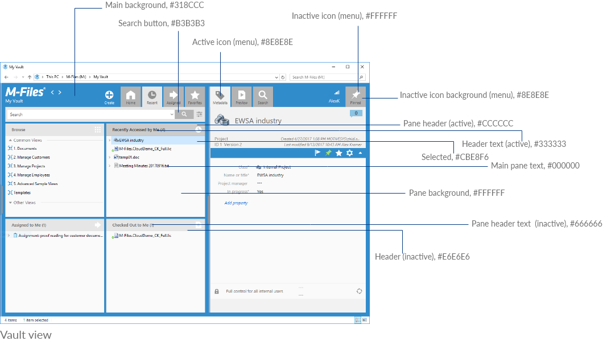
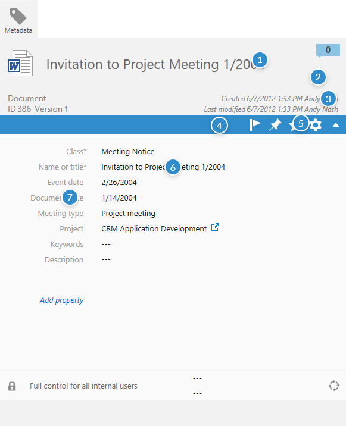
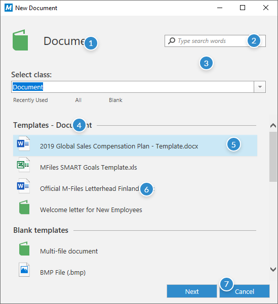
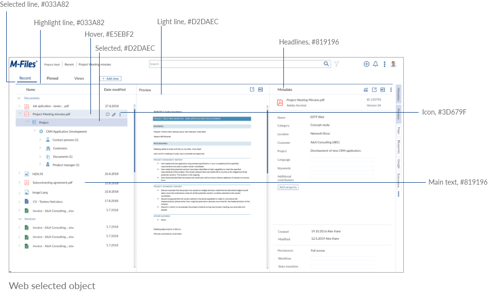
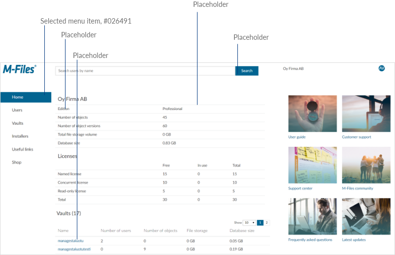

## Colors

Color | Color name  | Color code  | Where to use
--- | --- | --- |
{:.borderless .leftcol} | Main blue | #318CCC | Backgrounds, buttons
{:.borderless .leftcol} | Secondary blue | #3AABED | Metadata header
{:.borderless .leftcol} | Light blue | #CBE8F6| Selected item
{:.borderless .leftcol} | Light blue 2 | #E5F3FF| Hover
{:.borderless .leftcol} | Main white | #FFFFFF | Backgrounds, text color, inactive icon
{:.borderless .leftcol} | Main black | #000000 | Text color
{:.borderless .leftcol} | Gray 1 | #333333 | Base text color
{:.borderless .leftcol} | Gray 2 | #666666 | Header text  (inactive)
{:.borderless .leftcol} | Gray 3 | #676767 | Metadata card heading
{:.borderless .leftcol} | Gray 4 | #808080 | Metadata card italic sub-heading
{:.borderless .leftcol} | Gray 5 | #999999 |  Metadata card left text
{:.borderless .leftcol} | Gray 6 | #B3B3B3 | Search button, Task pane menu item (upper)
{:.borderless .leftcol} | Gray 7 | #CCCCCC | Pane header (active)
{:.borderless .leftcol} | Gray 8 | #E6E6E6 | Pane header (inactive)
{:.borderless .leftcol} | Gray 9  | #F2F2F2 | Dialog background 

## How to use and when

### Vault view colors

{:.borderless}

1. Main blue, #318CCC
2. Gray 8, #E6E6E6
3. Gray 6, #B3B3B3
4. Gray 6, #B3B3B3
5. Gray 7, #CCCCCC
6. Gray 6, #333333
7. Light blue, #CBE8F6
8. Main black, #000000
9. Main white, #FFFFFF
10. Gray 2, #666666
11. Gray 8, #E6E6E6

### Metadata colors

{:.borderless}

1. Gray 3, #676767
2. Gray 9, #F2F2F2
3. Gray 4, #808080
4. Main blue, #318CCC
5. Main white, #FFFFFF (icon)
6.  Main black, #000000
7.  Gray 5, #999999

### Create vault colors

{:.borderless}

1. Gray 1, #333333
2. Main white, #FFFFFF
3. Gray 9, #F2F2F2
4. Gray 1,  #333333
5. Light blue, #CBE8F6
6. Gray 1, #333333
7. Main blue, #318CCC

 

---> Web colors

## Web colors

| |
--- | --- | ---
Background colors |  | 
{:.borderless .leftcol} | Main background | #FFFFFF
Text |  | 
{:.borderless .leftcol} | Main text | #819196
Lines |  | 
{:.borderless .leftcol} | Highlight line | #033A82
{:.borderless .leftcol} | Light line | #D2DAEC
Headers |  | 
{:.borderless .leftcol} | Headlines | #819196
{:.borderless .leftcol} | Property headline  | #50575D
Icons |  | 
{:.borderless .leftcol} | Icon | #3D679F
Hover |  | 
{:.borderless .leftcol} | Hover | #E5EBF2
Other |  |
{:.borderless .leftcol} | Notification warning | #EF583F
{:.borderless .leftcol} | Boxes | #819196

## Web colors how to use and when

{:.borderless}

---> Manage colors

## Manage Colors

| | 
--- | --- | ---
Background colors |  | 
{:.borderless .leftcol} | Main background | #FFFFFF
{:.borderless .leftcol} | Highlight background | #E0ECF1
{:.borderless .leftcol} | Selected menu item | #026491
Headers |  | 
{:.borderless .leftcol} | Header (active) | #026491
Text |  | 
{:.borderless .leftcol} | Header (active) | #424242
{:.borderless .leftcol} | Header (active) | #026491
Buttons |  | 
{:.borderless .leftcol} | Buttons | #026491
Lines |  | 
{:.borderless .leftcol} | Heading underline | #026491
{:.borderless .leftcol} | Heading underline | #CBDDE2
{:.borderless .leftcol} | Heading underline | #EAECED
Icons |  | 
{:.borderless .leftcol} | Icons | #026491

## Manage colors how to use and when

{:.borderless}

