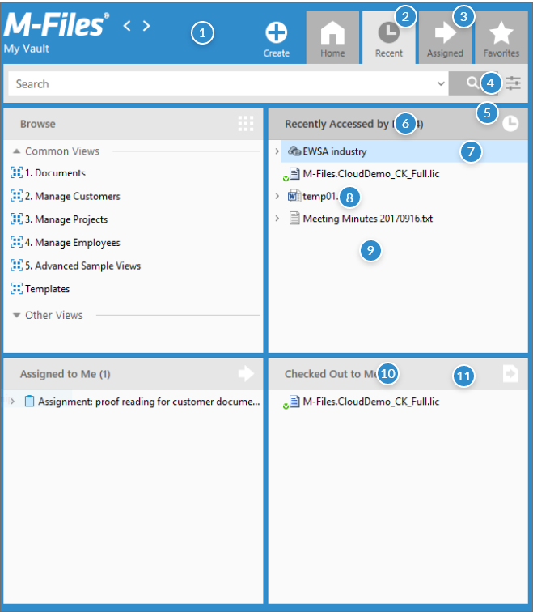

## Colors

 |  | 
--- | --- | ---
Background colors |  | 
{:.borderless .leftcol} | Main background | #318CCC
{:.borderless .leftcol} | White background | #FFFFFF
{:.borderless .leftcol} | Dialog background | #F2F2F2
Header colors |  | 
{:.borderless .leftcol} | Metadata header | #3AABED
{:.borderless .leftcol} | Pane header (inactive) | #E6E6E6
{:.borderless .leftcol} | Pane header (active) | #CCCCCC
Text colors |  | 
{:.borderless .leftcol} | Main text | #000000
{:.borderless .leftcol} | Header text | #333333
{:.borderless .leftcol} | Header text  (inactive) | #666666
{:.borderless .leftcol} | Task pane menu text | #FFFFFF
Button colors |  | 
{:.borderless .leftcol} | Search button | #B3B3B3
{:.borderless .leftcol} | Main button | #318CCC
Icon colors |  | 
{:.borderless .leftcol} | Active icon (menu) | #8E8E8E
{:.borderless .leftcol} | Inactive icon (menu) | #FFFFFF
Menu colors |  | 
{:.borderless .leftcol} | Task pane menu item (upper) | #B3B3B3
{:.borderless .leftcol} | Task pane menu item (lower) | #989898
Hover colors |  | 
{:.borderless .leftcol} | Hover | #E5F3FF

## How to use and when

{:.borderless}

{:.borderless}

 

---> Web colors

## Colors

| |
--- | --- | ---
Background colors |  | 
{:.borderless .leftcol} | Main background | #FFFFFF
Text |  | 
{:.borderless .leftcol} | Main text | #819196
Lines |  | 
{:.borderless .leftcol} | Highlight line | #033A82
{:.borderless .leftcol} | Light line | #D2DAEC
Headers |  | 
{:.borderless .leftcol} | Headlines | #819196
{:.borderless .leftcol} | Property headline  | #50575D
Icons |  | 
{:.borderless .leftcol} | Icon | #3D679F
Hover |  | 
{:.borderless .leftcol} | Hover | #E5EBF2
Other |  |
{:.borderless .leftcol} | Notification warning | #EF583F
{:.borderless .leftcol} | Boxes | #819196

## How to use and when

{:.borderless}

---> Manage colors

## Colors

. . . . . . . . . . . . . . . . . . . . . . . . . . . . . . | . . . . . . . . . . . . . . . . . . . . . . . . . . . . . . . . . . . . . . . . . . . . . . . . . . . . . . . . . . . . | . . . . . . . . . . . . . . . .
--- | --- | ---
Background colors |  | 
{:.borderless .leftcol} | Main background | #FFFFFF
{:.borderless .leftcol} | Highlight background | #E0ECF1
{:.borderless .leftcol} | Selected menu item | #026491
Headers |  | 
{:.borderless .leftcol} | Header (active) | #026491
Text |  | 
{:.borderless .leftcol} | Header (active) | #424242
{:.borderless .leftcol} | Header (active) | #026491
Buttons |  | 
{:.borderless .leftcol} | Buttons | #026491
Lines |  | 
{:.borderless .leftcol} | Heading underline | #026491
{:.borderless .leftcol} | Heading underline | #CBDDE2
{:.borderless .leftcol} | Heading underline | #EAECED
Icons |  | 
{:.borderless .leftcol} | Icons | #026491

## How to use and when

{:.borderless}

