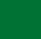
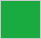
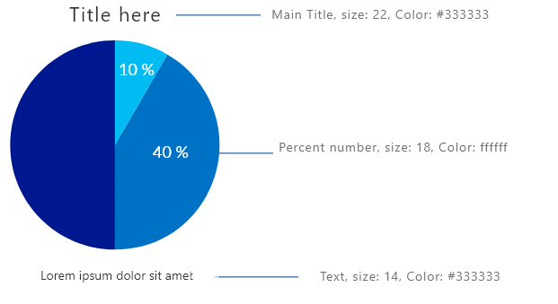
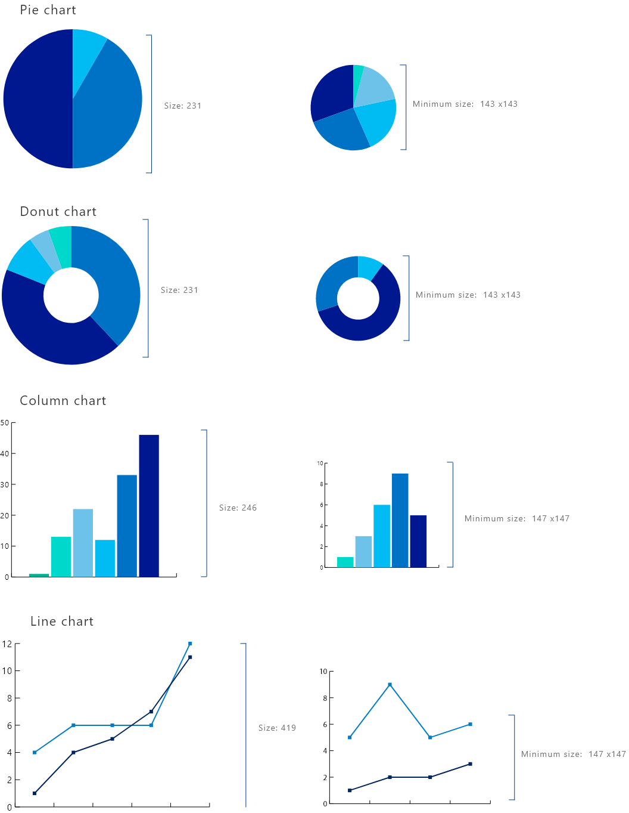
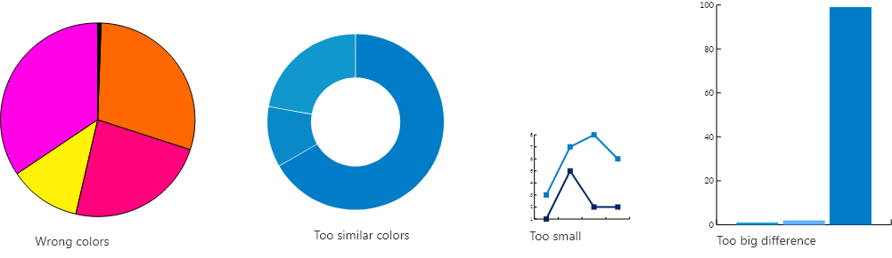

## Colors

Color | Color name | Color code
--- | --- | ---
Primary colors |  | 
{:.borderless .leftcol} | Primary color #1 | #00188F
{:.borderless .leftcol} | Primary color #2 | #0072C6s
{:.borderless .leftcol} | Primary color #3 | #00BCF2
{:.borderless .leftcol} | Primary color #4 | #6DC2E9
{:.borderless .leftcol} | Primary color #5 | #00D8CC
{:.borderless .leftcol} | Primary color #6 | #00B294
{:.borderless .leftcol} | Primary color #7 | #007233
{:.borderless .leftcol} | Primary color #8 | #08A14E
Sentiment colors |  | 
{:.borderless .leftcol} | Negative | #D64554
{:.borderless .leftcol} | Positive | #1AAB40
{:.borderless .leftcol} | Neutral | #D9B300
Divergent colors |  | 
{:.borderless .leftcol} | Max | #262A76
{:.borderless .leftcol} | Middle | #0072C6
{:.borderless .leftcol} | Min | #00BCF2
Font colors |  | 
{:.borderless .leftcol} | General | #707070
{:.borderless .leftcol} | Title | #585858 

## Typography

Typography used in data visalization is Segoe UI.

{:.borderless .leftcol}

## Chart design

{:.borderless .leftcol}

## Avoid these

{:.borderless .leftcol}