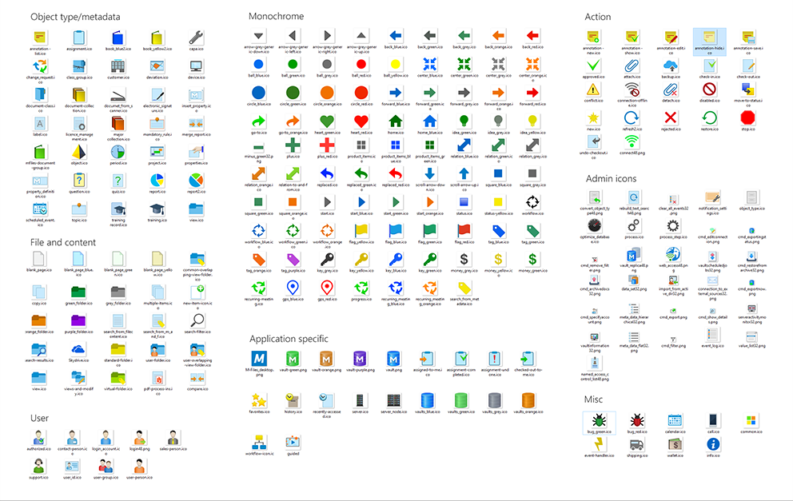
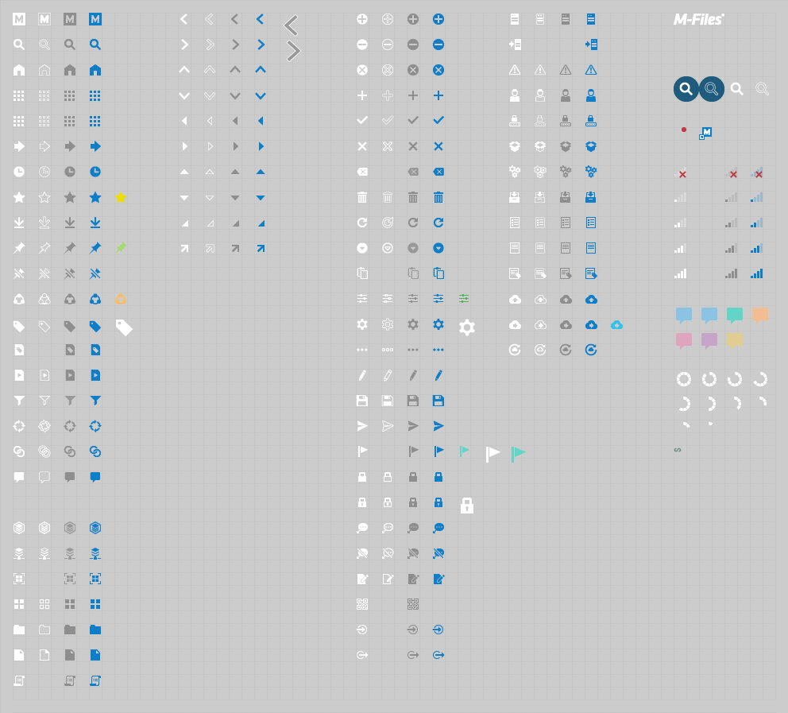

### Fonts

M-Files2018 is using "Segoe UI"© font family by Microsoft® as default font family. Weightiness in use are: light, regular and semibold.  
For specific font sizes, refer to "Style and layout parameters" in each section.  

### Icons

M-Files icon set is evolving towards simplicity. Target is to create a visual presentation for swift-recognision of each essencial idea and globle priciples of how they work together. In order to provide brand new visual experience and secure the functionality at same time, we created a harmomy of two icon style together and keep evolotion progressing.

##### Triditional icon set in categories
{:.borderless}
##### Upgraded 
{:.borderless}

##### Icon package can be found from [Resources] section