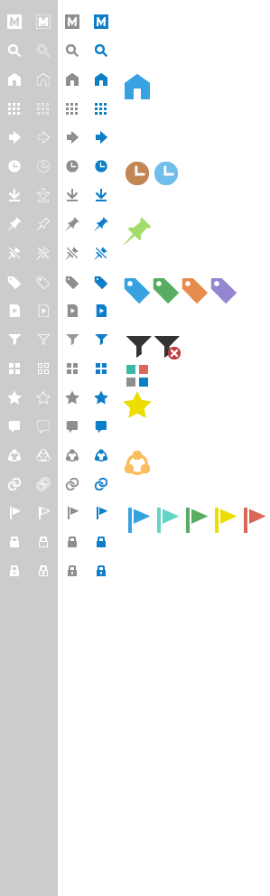

## Fonts

M-Files 2018 uses the `Segoe UI` &copy; font family by Microsoft &reg; as default font family. Weightiness in use are: light, regular and semibold.  
Specific font sizes are shown in the "Style and layout parameters" in the associated [Page Layout]({{ site.baseurl }}/UX-Design/Page-Layout/) sections.

## Icons

The M-Files icon set is evolving towards simplicity. The target is to allow users to easily and quickly recognise structures and operations through visual presentation. 

### Icon package download

<ul class="quicklinks">
	<li class="api"><a href="{{ site.baseurl }}/UX-Design/Icons-and-Fonts/MFiles2018_icon_package.zip">
	<i class="zmdi zmdi-download"></i> &nbsp;
	Download M-Files 2018 icon package (14.5mb)</a></li>
</ul>



The download above includes all the images shown below in a variety of formats.
{:.note}

<!-- REPLACE WITH ICON SYSTEM! -->

### Main navigation

{:.borderless}

### Object type and class

{:.borderless}
{:.borderless}

### Actions and functions

{:.borderless} 
{:.borderless}

### Administration and settings

{:.borderless}

### Brand, status, etc.

{:.borderless}

