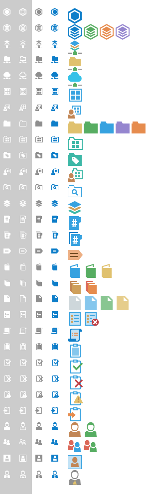
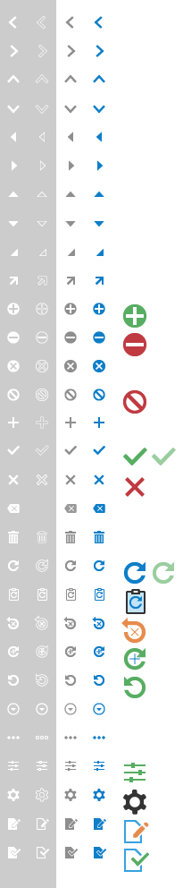
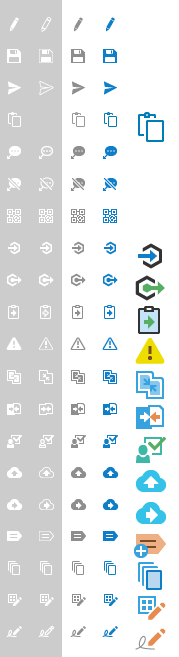

### Icons

M-Files icon set is evolving towards simplicity. Target is to create a visual presentation for swift-recognision of each essencial idea and globle priciples of how they work together. In order to provide brand new visual experience and secure the functionality at same time, we created a harmomy of two icon style together and keep evolotion progressing.

##### Icon set in categories
{:.borderless}  
{:.borderless}
{:.borderless}  
{:.borderless} 
{:.borderless}  
{:.borderless}  
{:.borderless}

### Icon package download
<ul class="quicklinks">
	<li class="api"><a href="{{ site.baseurl }}/UX-Design/Icons-and-Fonts/MFiles2018_icon_package.zip">
	<i class="zmdi zmdi-download"></i> &nbsp;
	Download M-Files 2018 icon package (14.5mb)</a></li>
</ul>

### Fonts

M-Files2018 is using "Segoe UI"© font family by Microsoft® as default font family. Weightiness in use are: light, regular and semibold.  
For specific font sizes, refer to "Style and layout parameters" in each section.