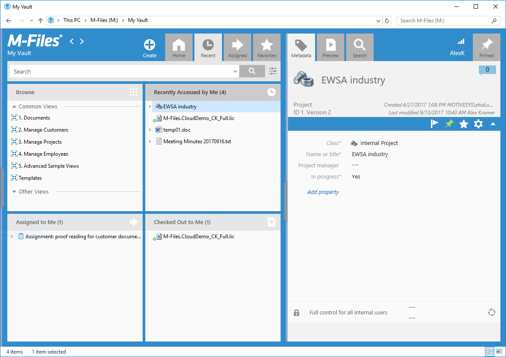
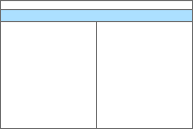
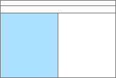
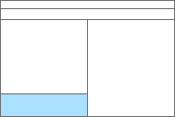
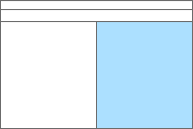
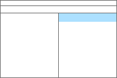
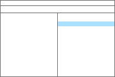
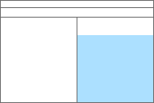
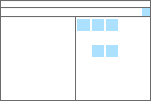
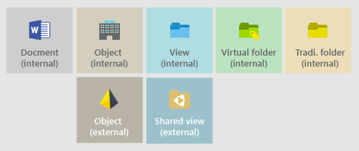

M-Files 2018 Desktop client layout design is a visual flow based on navigation hierarchy. From top to down, M-Files, vaults, views and objects. From each level, corresponding operations are in place and can be accessed accordingly.

{:.borderless .clear}

### Layout areas

M-Files 2018 Desktop client layout include three general areas by their functionalities.
* Top Pane holds essential features that are needed all the time, such as structured navigation and vault level and user operations.
* Listing area occupies the left half below Top pane.  As described with its name, it provides access to the index of the desired contents.
* Right pane is at final level of the navigation, it contains the detailed cover information and object-level operations for selected file.
There are also sub-areas as bottom pane and task pane, and layout control behaviors inside and in between areas, which are explained below.

#### Top pane
{:.layout-section}

{:.borderless}

Top pane is a full-width header locate above the content areas of the application. It hosts most of the navigation function groups:

* M-File logo with link to home and navigation arrows
* A Breadcrumb shows current location
* Create function and vault main navigation tabs
* Object related taps and search filters
* Indication and account panel 
* Pinned tab

Style and layout parameters:  
Background-color: #318ccc  
Padding: 12px 0px 0px 0px  
Logo-size: 128x32px  
Font-size (Breadcrumb : flexible): 10px, 12px  
Font-color: #ffffff  
Navigation-arrow-size: 32px  
Indication-icon-size: 16px  

#### Listing area
{:.layout-section}

{:.borderless}

Listing area occupies left half of the application besides top pane and right pane. It lists all the file candidates upon browse navigation or search function. In most of cases, it will also have a search bar above content listing.
Sometime, it can also host multiple listing by micro layout, for example tiling.

Style and layout parameters:  
Background-color: #318ccc  
Margin: 0px 0px 10px 0px  
Background-color (listing area): #fafafa  

{:.borderless}

##### Bottom pane
{:.layout-section}

Bottom pane actually is a sub area within listing area. It provides an alter location for some contents to be shown simultaneously, especially for user with large display. For example, Metadata/property. More often, it attaches controls that are related with listing above. For example multiple vault search.

Style and layout parameters:  
Background-color: #318ccc  
Margin: 0px 6px 10px 0px  

#### Right pane
{:.layout-section}

{:.borderless}

Right pane plays an important row in offering detailed control options over object properties, previews, search and personalization. Its contents switch contextually according to the selected object or current function. Furthermore, it can be switched manually with tabs above it inside top pane. 

Style and layout parameters:  
Background-color: #318ccc  
Margin: 0px 10px 10px 0px  

{:.borderless}

##### Header
{:.layout-section}

Header is the top most part inside right pane. Often it is used to show the vital information of the content.

Style and layout parameters:  
Background-color: #f2f2f2  
Padding: 10px 10px 0px 10px  
Height: 130px  
Font-color: #666666  
Font-size (heading):  22px  
Font-size (subheading): 14px  
Font-size (italic): 12px  

{:.borderless}

##### Object tools ribbon
{:.layout-section}

Tools ribbon collects function buttons related with specific selection of the object or function.

Style and layout parameters:  
Background-color: #318ccc  
Padding: 4px 6px 4px 14px  
Height: 32px  
Icons-size: 24px  
Font-color: #ffffff  

{:.borderless}

##### Metadata form
{:.layout-section}

Metadata form is the place where you can view or even change properties of the selected object or functions.

Style and layout parameters:  
Background-color: #fafafa  
Padding: 20px 8px 0px 0px  
Font-size: 13px  
Font-color: #999999, #5a5a5a, #1a1a1a  
Font-color (link): #0069dd  
Row height: 26px  

{:.borderless}

##### Pinned
{:.layout-section}

Pinned is the last tab from top pane, it shares the area with right pane. It is a place where user can collect all kinds of object and links, and personalize at certain extend. 

Style and layout parameters:  
Background-color: #f2f2f2  
Padding: 4px  
Font-color: #666666  
Font-size: 13px  
Cell-size: 96px  
Cell-icon-size: 32px  
Cell-margin: 4px  
Cell-background-color* : #cfcfcf, # d4cfbf, # b1dee3, # bce3c0, #eddfb9, #bab4a9, #9dc2cc  

###### List of color codings for cell categories  
{:.layout-section}

{:.borderless}

