{:.borderless .clear}

## Layout areas

The M-Files Desktop client layout includes three general layout areas:

* The [Top Pane](#top-pane) holds essential features that are needed all the time, such as structured navigation and vault- and user-operations.
* The [Listing Area](#listing-area) occupies the left half below the [Top Pane](#top-pane).  The listing area shows access to content as the user navigates the vault structure.
* The [Right Pane](#right-pane) is at final level of the navigation, it contains the metadata and object-operations for selected object(s).

There are also sub-areas as the [Bottom Pane](#bottom-pane) and the [Task Pane](#task-pane), which are explained further below.

### Top Pane

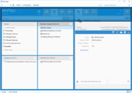{:.borderless .leftcol}

{:.rightcol}
The `Top Pane` is a full-width header located above the content areas of the application. It hosts most of the navigation function groups:

{:.rightcol}
* M-File logo with link to home and navigation arrows
* A [breadcrumb]({{ site.baseurl }}/UX-Design/Navigation-patterns/#breadcrumb) shows current location
* Create function and vault main navigation tabs
* Object related tabs and search filters
* The account panel (to log out, to alter notification settings, and to log in/out of external repositories)
* The [Pinned tab]({{ site.baseurl }}/UX-Design/Page-Layout/#pinned)

{:.rightcol}
**Style and layout parameters:**   
Background-color: #318ccc  
Padding: 12px 0px 0px 0px  
Logo-size: 128x32px  
Font-size (Breadcrumb : flexible): 10px, 12px  
Font-color: #ffffff  
Navigation-arrow-size: 32px  
Indication-icon-size: 16px  

### Listing Area

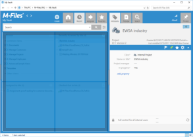{:.borderless .leftcol}

{:.rightcol}
The `Listing Area` occupies the left half of the application underneath the [Top Pane](#top-pane). It lists all views, files and other objects when navigating views or searching. In most of cases, it will also have a search bar above content listing.  Sometimes, it can also host multiple listings, for example the [tiling on the home view](#tiling).

{:.rightcol}
**Style and layout parameters:**   
Background-color: #318ccc  
Margin: 0px 0px 10px 0px  
Background-color (listing area): #fafafa  

#### Bottom Pane
{:.rightcol}

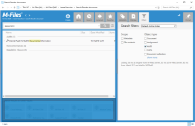{:.borderless .leftcol}

{:.rightcol}
The `Bottom Pane` actually is a sub area within the [Listing Area](#listing-area). It provides an alternate location for content to be shown, e.g. the [selected object's metadata](#metadata-form). It may also contain elements such as the multiple-vault search. Additionally, the contents of the bottom can be customised using the [User Interface Extensibility Framework]({{ site.baseurl }}/Frameworks/User-Interface-Extensibility-Framework/Dashboards/#replacing-the-right-or-bottom-panes).

{:.rightcol}
**Style and layout parameters:**   
Background-color: #318ccc  
Margin: 0px 6px 10px 0px  

### Right Pane

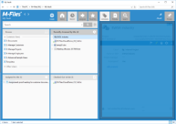{:.borderless .leftcol}

{:.rightcol}
The `Right Pane` plays an important role in offering detailed control options over object properties, previews, search and personalization. Its contents switch contextually according to the selected object or current function. Additionally, the contents of the right pane can be customised using the [User Interface Extensibility Framework]({{ site.baseurl }}/Frameworks/User-Interface-Extensibility-Framework/Dashboards/#within-a-custom-tab) to show additional tabs of content. 

{:.rightcol}
**Style and layout parameters:**   
Background-color: #318ccc  
Margin: 0px 10px 10px 0px  

#### Header
{:.rightcol}

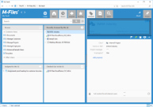{:.borderless .leftcol}

{:.rightcol}
The `Right Pane Header` is the top most part inside the [Right Pane](#right-pane). Often it is used to show the vital information of the selected item, such as the object ID, version, and checkout information.

{:.rightcol}
**Style and layout parameters:**   
Background-color: #f2f2f2  
Padding: 10px 10px 0px 10px  
Height: 130px  
Font-color: #666666  
Font-size (heading):  22px  
Font-size (subheading): 14px  
Font-size (italic): 12px  

#### Object Tools Ribbon
{:.rightcol}

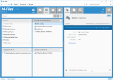{:.borderless .leftcol}

{:.rightcol}
The `Right Pane Object Tools Ribbon` collects shows buttons to execute common object-specific functions, such as following the object, or to add it to your pinboard or favorites.

{:.rightcol}
**Style and layout parameters:**   
Background-color: #318ccc  
Padding: 4px 6px 4px 14px  
Height: 32px  
Icons-size: 24px  
Font-color: #ffffff  

#### Metadata Form
{:.rightcol}

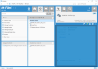{:.borderless .leftcol}

{:.rightcol}
The `Metadata Form` displays the properties of the selected object.  Depending on your access rights, you may also be able to edit some of the properties.  The layout is largely driven by the class of the selected object, but can be customised using [Metadata Card Configuration rules]({{ site.baseurl }}/Built-In/Metadata-Card-Configuration/).

{:.rightcol}
**Style and layout parameters:**   
Background-color: #fafafa  
Padding: 20px 8px 0px 0px  
Font-size: 13px  
Font-color: #999999, #5a5a5a, #1a1a1a  
Font-color (link): #0069dd  
Row height: 26px  

#### Pinned
{:.rightcol}

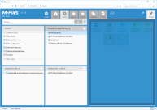{:.borderless .leftcol}

{:.rightcol}
The `Pinned` tab is the final tab in the [Top Pane](#top-pane), shown on the far right of the screen. Clicking the `Pinned` tab replaces the [Right Pane](#right-pane) with a pinboard, where users can create a personal collection of links to objects and views.  The contents of the pinboard are also available using the M-Files mobile applications. 

{:.rightcol}
**Style and layout parameters:**   
Background-color: #f2f2f2  
Padding: 4px  
Font-color: #666666  
Font-size: 13px  
Cell-size: 96px  
Cell-icon-size: 32px  
Cell-margin: 4px  
Cell-background-color* : #cfcfcf, # d4cfbf, # b1dee3, # bce3c0, #eddfb9, #bab4a9, #9dc2cc  

##### Color-codings for Pinned item categories 

{:.borderless}  

### Task Pane  

{:.borderless .leftcol}

{:.rightcol}
The `Task Pane` was previously be the place where all quick shortcuts were collected. The `Task Pane` can be collapsed and expanded by clicking of the handle on its right side. The task pane is kept for backwards compatibility.

{:.rightcol}
**Style and layout parameters:**   
Background-color: #d9d9d9  
Width: 156px  
Font-color: #ffffff  
Font-color (mouseover): #ffffff  
Font-size: 13px  
Font-size (Group header): 14px  
Cell-icon-size: 16px  
Cell-padding: 5px 10px  
Cell-margin: 0px 0px 0px 2px  
Cell-background-color: #989898  
Cell-background-color (mouseover): #aebfc9  
Cell-background-color (Group header): #b3b3b3  

## Layout Controls  

### Expanding/collapsing control  

Some panels have more flexibility with their layout. For example: both the [Right  Pane](#right-pane) and [Task Pane](#task-pane) can be collapsed to make additional space on the screen. This can be done by clicking the "handle" in the middle of the layout divider. Clicking the handle again will toggle the panel back to its original size.  

##### Collapsing in action for Right pane  

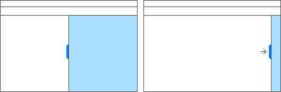{:.borderless}

##### Expanding action for Task pane  

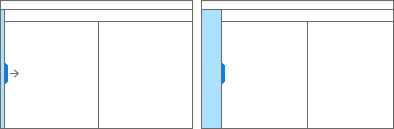{:.borderless}

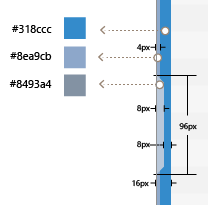{:.borderless .leftcol}

{:.rightcol}
**Style and layout parameters:**   
Background-color: #318ccc  
Width: 8px  
Border-width (divider line): 4px  
Border-color (divider line): # 8fabcc  
Handle-width: 8px  
Handle-color: # bac9db  
Handle-height: 100px  

### Tiling

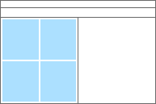{:.borderless .leftcol}

{:.borderless .rightcol}
In the `Home` view, the [Listing Area](#listing-area) is split into multiple "tiles"  in order to make more views accessible at same time.  These tiles include `Browse` (to navigate internal and external views), `Assigned to me`, `Recently Accessed by Me`, and `Checked Out to Me`.  The pinboard appears to the right of the tiled area.

 

## Web layout 

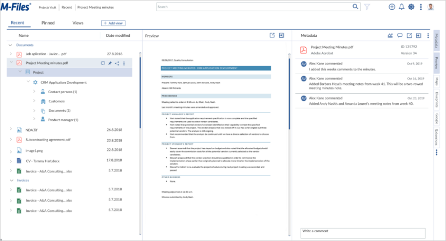{:.borderless .clear}

The M-Files Web layout includes six general layout areas:

* The Top header
* Menu
* Left Panel
* Center panel
* Right panel
* Side menu

There are also sub-areas.

### Top Header

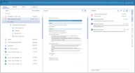{:.borderless .leftcol}

{:.rightcol}
The top header is full width header located above the content area. It includes sites basic functions:

{:.rightcol}
* M-Files logo with link to home
* Breadcrumb that shows current location
* Search function
* Filetering
* Notifications
* Settings
* User profile

{:.rightcol}
**Style and layout parameters:**   
Background-color: #FFFFFF   
Logo-size: 128.8 x 32px   
Font-size: 14px   
Font-color: #333333   
Icon-size: 26 x 26px   
Icon-color (active): #3D679F   
Icon-color (inactive): #D2DAEC   
Search-bar-size: 846 x 35px   

### Menu

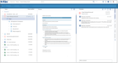{:.borderless .leftcol}

{:.rightcol}
Menu bar:

{:.rightcol}
* Pages 
* Add view 

{:.rightcol}
**Style and layout parameters:**   
Background-color: ##FFFFFF   
Font-size: 18px   
Font-color (active): #033A82   
Font-color (inactive): #333333   
Highligh-line-size: 93 x 3px   
Highligh-line-color: #033A82   
Line-size: 1756 x 2px   
Line-color: #3D679F   
Button-size: 100 x 22px   
Button-color: #3D679F   

### Left Panel

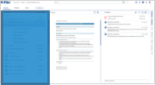{:.borderless .leftcol}

{:.rightcol}
Left panel includes:

{:.rightcol}
* Object list
* Comments
* Pinned
* Sharing
* File context menu

{:.rightcol}
**Style and layout parameters:**  
Background-color: #FFFFFF   
Font-size: 14px   
Font-color: #333333   
Icon-color: #3D679F   
Icon-size: 15 x 15 px   
Hover: #E5EBF2   
Selected: #D2DAEC   
Arrow-size: 7 x 14px   
Arrow-color: #979797   

### Center panel

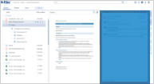{:.borderless .leftcol}

{:.rightcol}
Cemter panel includes preview of the selected object:

{:.rightcol}
* Preview
* Pop-up / Pop-out
* Hide pane

{:.rightcol}
**Style and layout parameters:**
Background-color: ##FFFFFF   
Preview-size: 585 x 784px   
Icon-color: #3D679F   
Icon-size: 20 x 20 px   

### Right Panel

{:.borderless .leftcol}

{:.rightcol}
Right panel includes metadata information:

{:.rightcol}
* Metadata objects
* Analyze
* Comments
* Sharing
* File context menu

{:.rightcol}
**Style and layout parameters:**  
Background-color: ##FFFFFF   
Font-size: 14px   
Font-color: #333333   
Line-size: 552 x 1px   
Line-color: #D2DAEC   
Icon-color: #3D679F   
Icon-size: 20 x 20 px   

### Side Menu

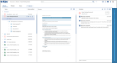{:.borderless .leftcol}

{:.rightcol}
Side menu includes different pages:

{:.rightcol}
* Metadata Preview, Maps, Blueprints, Google, Extensions
* File context menu

{:.rightcol}
**Style and layout parameters:**  
Background-color: #FFFFFF   
Item-background-color (active): #D2DAEC   
Item-background-color (inactive): #FFFFFF   
Item-box-size: 25 x 89px   
Font-size: 14px   
Font-color: #333333   
Icon-size: 8 x 24px   
Icon-color: #3D679F   

## Manage layout 

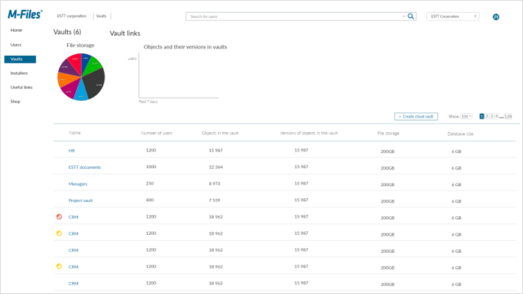{:.borderless .clear}

The M-Files Manage includes few different layouts. Vaults section is one of main layouts. Vaults layout includes five general layout areas:

* Top header
* Side menu
* Analytics view
* Table header
* Table content

There are also sub-areas.

### Top Header

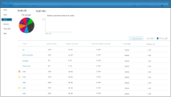{:.borderless .leftcol}

{:.rightcol}
The top header is full width header located above the content area. It includes sites basic functions:

{:.rightcol}
* M-Files logo with link to home
* Breadcrumb that shows current location
* Search function
* Company selection
* User profile

{:.rightcol}
**Style and layout parameters:** 
Background-color: #FFFFFF   
Logo-size: 128,04 x 32,02px   
Logo-color: #026491   
Font-size: 14px   
Font-color: #33333  
Icon-size: 24 x 24px   
Search-bar-size: 845 x 30px   
Dropdown-size: 193 x 30px   
Line-size: 1 x 47px   
Line-color: #969696   

### Side menu

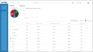{:.borderless .leftcol}

{:.rightcol}
Side menu allows acces to all sites:

{:.rightcol}
* Home, Users, Vaults, Installers, Useful links, Shop

{:.rightcol}
**Style and layout parameters:** 
Background-color: #FFFFFF   
Font-size: 16px   
Font-color (inactive): #000000   
Font-color (active): #FFFFFF   
Active-item-background-color: #026491   
Active-item-background-size: 116 x 28 px   

### Analytics view

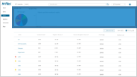{:.borderless .leftcol}

{:.rightcol}
Analytics view shows spesific analytics data:

{:.rightcol}
* Analytic data

{:.rightcol}
**Style and layout parameters:**
Background-color: #FFFFFF  
Heading-size: 25px   
Heading-color: #222222   
Image-size: 174 x 174 px   

### Table Header

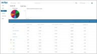{:.borderless .leftcol}

{:.rightcol}
Table header allows creation of new vault, searching vaults and shows table headers:

{:.rightcol}
* Create new vault
* Vault numbers to be shown   
* Vault page select   

{:.rightcol}
**Style and layout parameters:** 
Background-color: #FFFFFF   
Font-size: 16px   
Font-color: #333333   
Button-size: 160 x 27px   
Button-border-color: #026491   
Button-text-color: #026491   
Box-size: 8 x 17px   

### Table content

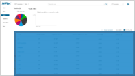{:.borderless .leftcol}

{:.rightcol}
Table content shows vaults and their information.

{:.rightcol}
* Vault information

{:.rightcol}
**Style and layout parameters:** 
Background-color: #FFFFFF   
Font-size: 16px   
Font-color: #333333   
Header-Line-size: 1713 x 3px   
Header-Line-color: #CBDDE2   
Line-size: 1700 x 2px   
Line-color: #EAECED   

