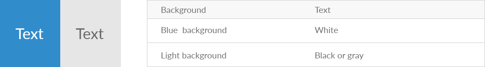
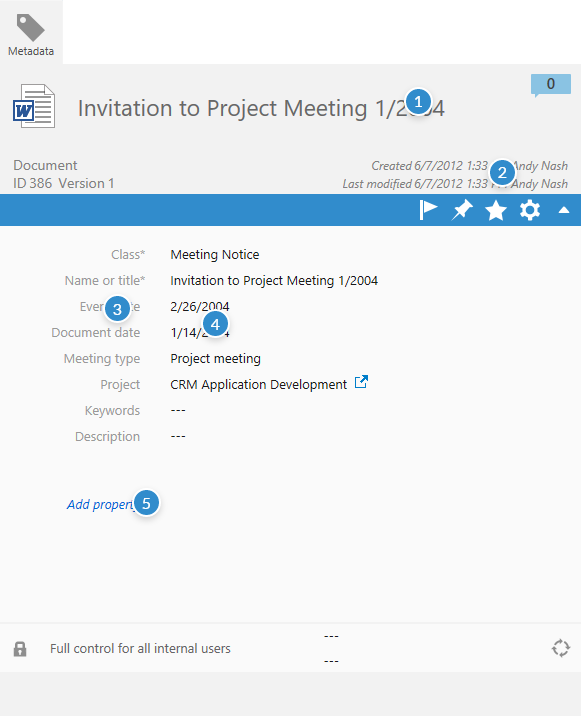
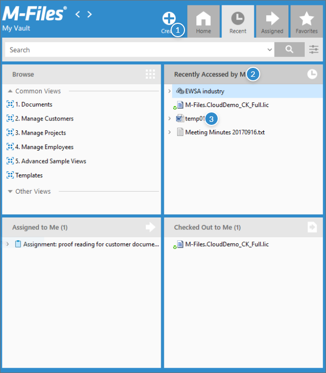

Good typography is invisible, enabling users to have a seamless experience while they’re using M-Files products.

## Typefaces
M-Files Desktop uses Segoe UI typeface. Segoe UI Bold is used especially to highlight pane headings and some other headings. Segoe UI Regular is used in many sections and is the most common typeface type in M-Files desktop.

{:.borderless}

## Scale

Typography scale changes according to text.

{:.borderless}

## Text and background

Text is displayed bit diferently depending on the background color. With blue background white text is used and with gray background darker text is used.

{:.borderless}

## How to use and when

Below is explained how to use different fonts in M-Files Desktop.

{:.borderless}

{:.borderless}

 

## Web Typography

### Typefaces

M-Files Web uses Lato typeface.

{:.borderless}

### Scale

Typography scale changes according to text.

{:.borderless}

### Text and background colors

Text is displayed bit diferently depending on the background color.

{:.borderless}

### How to use and when

Below is explained how to use different fonts in M-Files Web.

{:.borderless}

## Manage Typography

### Typefaces

M-Files Manage uses Lato typeface.

{:.borderless}

### Scale

Typography scale changes according to text.

{:.borderless}

### Text and background colors

Text is displayed bit diferently depending on the background color.

{:.borderless}

### How to use and when

Below is explained how to use different fonts in M-Files Web.

{:.borderless}

 