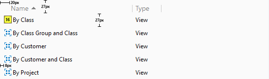
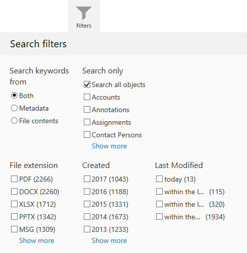

### Tabs

{:.borderless}

Located in top pane, `Tabs` provide direct access to views and functions. A tooltip with description of each tab's function will be shown when the user hovers the mouseover each tab.  

Tab layout is controlled through tab groups. Each tab group has a minimum number for visible tabs. When horizontal space is insufficient to show all the tabs inside a group, the hidden tabs will be collapsed under an expandable menu indicated by a "triangle" icon.  Currently, the two tab groups are "Vault Navigation" and "Details and Operations":

* Vault Navigation
	* Contains tabs to navigate to the vault `Home` view, and common views such as `Recently Accessed by Me`, `Assigned to Me`, and `Favourites`.
* Details and Operations
	* Contains tabs to view the selected object's metadata, to preview a selected file, or to search for objects.

Third party tabs created using the [User Interface Extensibility Framework](/Frameworks/User-Interface-Extensibility-Framework/) are located in the "Details and Operations" tab group.
{:.note}

{: .secondary}
**Style and layout parameters:**  
Tab-cell-size: 64px  
Background-color (inactive): #b3b3b3  
Background-color (active): # e6e6e6  
Margin: 4px  
Icon size: 32px  
Icon-color (Inactive): #ffffff  
Icon-color (active): # 999999  
Font-size: 11px  
Font-color: #555555  

### Lists

{:.borderless}

A `List` is the typical method for displaying a collection of multiple items such as views or objects. Lists are mostly located within the [Listing Area](/UX-Design/Page-Layout/#listing-area).

{: .secondary}
**Style and layout parameters:**  
Row-height: 27px  
Font-color (heading): #808080  
Font-size (heading): 14px  
Padding-left (heading): 20px:  
Font-color (listing): #000000  
Font-size (listing): 12px  
Padding-left (listing): 8px:  
Icon-size: 16px  

#### List grouping header
{:.borderless}

A `List Grouping` can be used to organize listed objects, grouping them by object type or a specific metadata property. The grouping appears as a header component with textual title and expanding/collapsing control on right side.  

{: .secondary}
**Style and layout parameters:**  
Background-color: #fafafa  
Height: 27px  
Font-color: #5a5a5a  
Font-size: 13px  

#### Search 

##### Search bar

{:.borderless}

##### Search filter

{:.borderless}