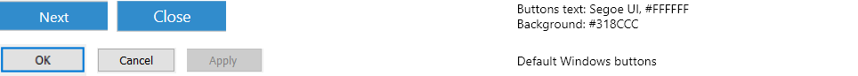
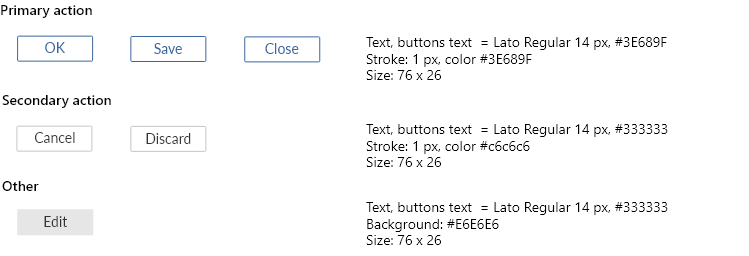

## Tabs

Located in top pane, `Tabs` provide direct access to views and functions. A tooltip with description of each tab's function will be shown when the user hovers the mouseover each tab.  

Tab layout is controlled through tab groups. Each tab group has a minimum number for visible tabs. When horizontal space is insufficient to show all the tabs inside a group, the hidden tabs will be collapsed under an expandable menu indicated by a "triangle" icon.  Currently, the two tab groups are `Vault Navigation` and `Details and Operations`.

{: .secondary}
**Style and layout parameters:**  
Tab-cell-size: 64px  
Background-color (inactive): #b3b3b3  
Background-color (active): # e6e6e6  
Margin: 4px  
Icon size: 32px  
Icon-color (Inactive): #ffffff  
Icon-color (active): # 999999  
Font-size: 11px  
Font-color: #555555 

### Vault Navigation

The `Vault Navigation` tab group contains tabs to navigate to the vault `Home` view, and common views such as `Recently Accessed by Me`, `Assigned to Me`, and `Favorites`.

### Details and Operations

The `Details and Operations` tab group contains tabs to view the selected object's metadata, to preview a selected file, or to search for objects.

Third party tabs created using the [User Interface Extensibility Framework]({{ site.baseurl }}/Frameworks/User-Interface-Extensibility-Framework/) are located in the `Details and Operations` tab group.
{:.note} 

## Lists

A `List` is the typical method for displaying a collection of multiple items such as views or objects. Lists are mostly located within the [Listing Area]({{ site.baseurl }}/UX-Design/Page-Layout/#listing-area).

{: .secondary}
**Style and layout parameters:**  
Row-height: 27px  
Font-color (heading): #808080  
Font-size (heading): 14px  
Padding-left (heading): 20px:  
Font-color (listing): #000000  
Font-size (listing): 12px  
Padding-left (listing): 8px:  
Icon-size: 16px  

### List grouping header
{:.borderless}

A `List Grouping` can be used to organize listed objects, grouping them by object type or a specific metadata property. The grouping appears as a header component with textual title and expanding/collapsing control on right side.  

{: .secondary}
**Style and layout parameters:**  
Background-color: #fafafa  
Height: 27px  
Font-color: #5a5a5a  
Font-size: 13px  

## Search 

Search function in M-Files is hosted by `Search bar`, and enhanced by `Search filters` and `Advanced search options`.  

### Search bar

Right above the Listing area, a `Search Bar` with search field, search button and access to `Advances search options` can be found.  

#### Search filter

`Search Filters` tab will be activated when search field is focused.  User will found options to enhance the search function before or after search is performed.  

#### Advanced search options

`Advanced search options` will be toggled on or off by clicking on the right most icon of the Search bar.  

## Dialogs 

Example of a common `Dialog` in M-Files that consists a title, an icon, a dialog message and a button group.  

## Menus

Here is an example of a context menu activated by right-click on an object which provides corresponding functions.  

Context menu items can be added using the [User Interface Extensibility Framework]({{ site.baseurl }}/Frameworks/User-Interface-Extensibility-Framework/).
 
## Metadata card 

`Metadata Card` is dedicated for displaying and editing Metadata for object classification and basic properties of selected object(s). User also can access object related functions from `Function Ribbon`.  

### Function Ribbon 

By using function buttons on the ribbon, user are able to Follow, Pin, or add an object to their Favorites list. With the M-Files release, we also introduced the `Analyze` button. Clicking this button will execute any registered [Intelligence Services](https://www.m-files.com/user-guide/latest/eng/intelligence_services.html) for the document, and show any additional metadata suggestions on the metadata card.

### Buttons

Buttons are used to move to the next step, confirm or cancel actions.

{:.borderless}

 

## Web UI Components

### Search
Top of the page, a Search Bar with search field, search button and access to filter option can be found.

{:.borderless}

{: .secondary}
**Style and layout parameters:**  
Font-color: #333333   
Font-size: 18px   
Search-bar: 846 x 40 px   
Icon-color-active: #D2DAEC   
Icon color-inactive: #3D679F   
Icon-size: 24 x 24 px   

#### Search filter
Filters can be acceded from the filter icon next to search bar. You can filter search objects with the filter list.

{:.borderless}

{: .secondary}
**Style and layout parameters:**  
Font-color: #222222   
Font-size: 14px   
Sub-font-size: 12px   

### Menu
Below log, breadcrumb and search is the main menu. Here you can acces views: Recent, Pinned, Views, others (customized views) and add new view.

{:.borderless}

{: .secondary}
**Style and layout parameters:**  
Font-color: #222222   
Font-size: 20px   
UnderLine-color: #033A82   
Divider-color: #3D679F   
Button-color: #3D679F   

### Lists
List view shows search results.

{:.borderless}

{: .secondary}
**Style and layout parameters:**  
Font-size: 14px   
Font-color: #333333   
Hover-first: #E5EBF2   
Hover-second: #D2DAEC   

### Preview

Preview window shows preview of the selected object.

### Metadata

{:.borderless}

{: .secondary}
**Style and layout parameters:**  
Font-size: 14px   
Font-color: #333333   
Second-Font-color: #50575D   
Progress-Font-color: #033A82   

### Tabs

{:.borderless}

{: .secondary}
**Style and layout parameters:**  
Item-background-color (active): #D2DAEC   
Item-background-color (inactive): #FFFFFF   
Item-box-size: 25 x 89px   
Font-size: 14px   
Font-color: #333333   
Icon-size: 8 x 24px   
Icon-color: #3D679F   

### Pinned

{:.borderless}

{: .secondary}
**Style and layout parameters:**  
Pinned-box-size: 107 x 107px

### Buttons
There are few different button types:

{:.borderless}

### Dialogs
In this section you will find information about dialogs. Note that dialogs are always 408 px or 758 wide. Height varies with content.

Button sizes = 76 x 26 px 

{:.borderless}

{: .secondary}
**Style and layout parameters:**  
Font-size: 14px   
Font-color: #333333   

## Manage UI components

### Search
M-Files Manage search bar allows user search. Next to it is also subscription selection.

{:.borderless}

{: .secondary}
**Style and layout parameters:**  
Font-size: 14px   
Font-color-search: #A1A1A1   
Font-color-subscription: #424242    

### Dialogs

{:.borderless}

{: .secondary}
**Style and layout parameters:**  
Heading-font-size: 20px   
Heading-font-color: #000000   
Font-size: 14px   
Font-color: #333333  

### Tables

{:.borderless}

{: .secondary}
**Style and layout parameters:**  
Font-size: 16 px   
Font-color: #333333   
Line-color: #CBDDE2   
Line-color-short: #EAECED   

### Buttons
There are few different button types:

{:.borderless}

### Menu

{:.borderless}

{: .secondary}
**Style and layout parameters:**  
Selected-item-background: #026491   
Font-size: 16 px   
Font-color-selected: #FFFFFF   
Font-color-unselected: #222222   

