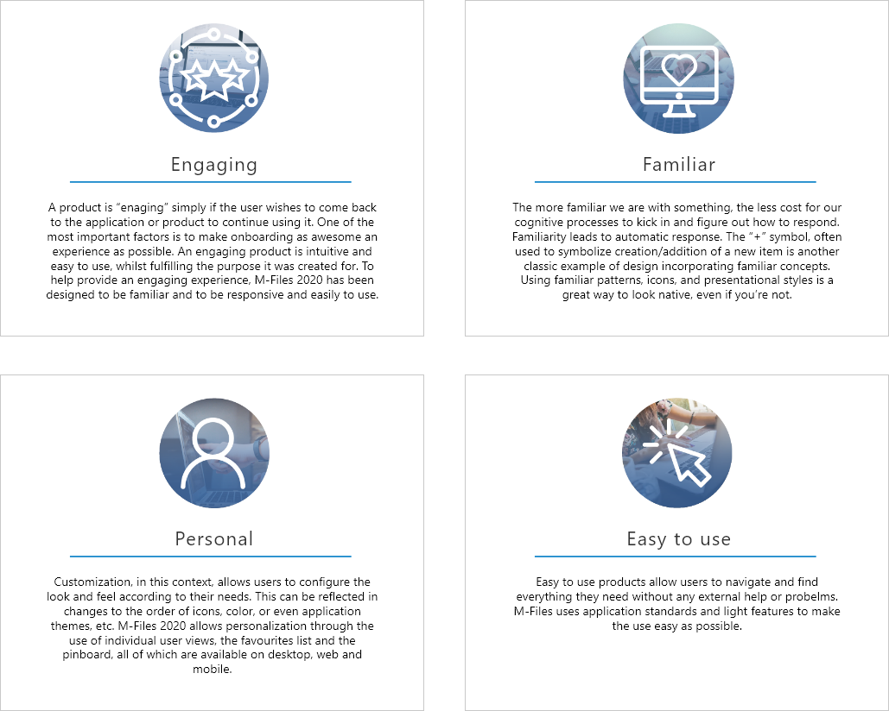

This document is intended to brief developers on the design principles of the M-Files UI, and to introduce the UI components used in desktop development. It targets  M-Files partners and developers who are building applications or services that need to replicate the M-Files "look and feel".

M-Files Online contains an updated user interface in the desktop client. The following design principles have been followed throughout the design process:

{:.borderless} 



## Engaging

A product is "enaging" simply if the user wishes to come back to the application or product to continue using it.  One of the most important factors is to make onboarding as awesome an experience as possible. An engaging product is intuitive and easy to use, whilst fulfilling the purpose it was created for.  To help provide an engaging experience, M-Files 2018 has been designed to be familiar and to be responsive and easily to use.

## Familiar

The more familiar we are with something, the less cost for our cognitive processes to kick in and figure out how to respond. Familiarity leads to automatic response. The "+" symbol, often used to symbolize creation/addition of a new item is another classic example of design incorporating familiar concepts.  Using familiar patterns, icons, and presentational styles is a great way to look native, even if you're not.

## Personal

Customization, in this context, allows users to configure the look and feel according to their needs. This can be reflected in changes to the order of icons, color, or even [application themes]({{ site.baseurl }}/Built-In/Theming/), etc.  M-Files 2018 allows personalization through the use of [individual user views](https://www.m-files.com/user-guide/latest/eng/New_view.html#new_view), the [favourites list](https://www.m-files.com/user-guide/latest/eng/task_area.html?hl=favorites#task_area__section_F1548BD48D564D35A685D69F2413D73F) and the [pinboard](https://www.m-files.com/user-guide/latest/eng/the_pinned_tab.html?hl=pinned), all of which are available on desktop, web and mobile.

