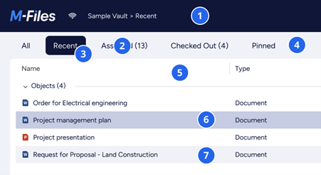
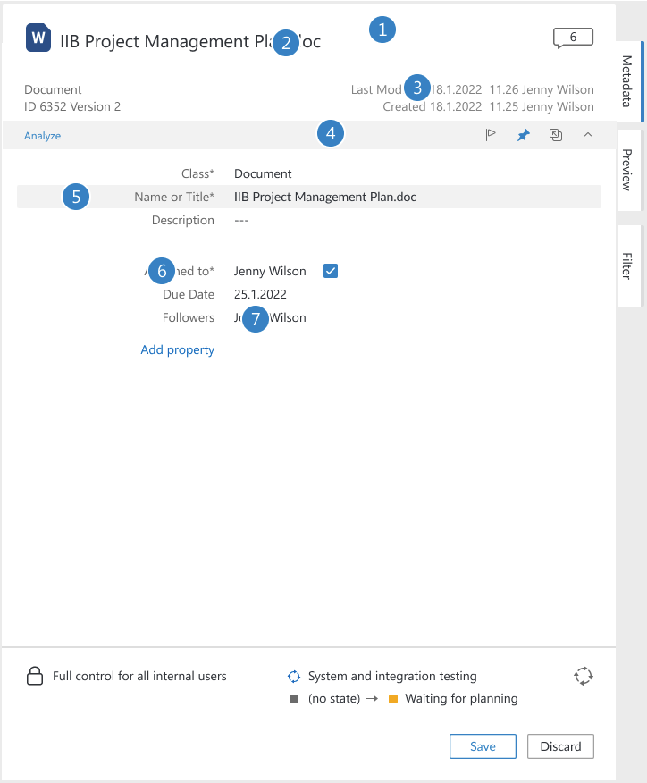

This page describes the various colors used by M-Files clients.

## Colors

### Night Sky

Night Sky 100
{: .color style="--hex-color: #0A1541" data-hex="#0A1541" data-where="Main text, surface, selection" }
Night Sky 80
{: .color style="--hex-color: #3B4467" data-hex="#3B4467" data-where="Surface, field title text" }
Night Sky 60
{: .color style="--hex-color: #6C728D" data-hex="#6C728D" data-where="Secondary text" }
Night Sky 40
{: .color .invert style="--hex-color: #9DA1B3" data-hex="#9DA1B3" data-where="Text box border" }
Night Sky 20
{: .color .invert style="--hex-color: #CED0D9" data-hex="#CED0D9" data-where="Table borders, Lines, Disabled, icon select" }
Night Sky 10
{: .color .invert style="--hex-color: #E6E8EC" data-hex="#E6E8EC" data-where="Surface" }

### Blue Moment

Blue Moment 100
{: .color style="--hex-color: #006EEF" data-hex="#006EEF" data-where="Primary, button" }
Blue Moment 100 (links)
{: .color style="--hex-color: #0069E0" data-hex="#0069E0" data-where="Primary (links)" }
Blue Moment 80
{: .color style="--hex-color: #338BF2" data-hex="#338BF2" data-where="M-Logo, Surface" }
Blue Moment 60
{: .color style="--hex-color: #66A8F5" data-hex="#66A8F5" data-where="Surface" }
Blue Moment 40
{: .color .invert style="--hex-color: #99C5F9" data-hex="#99C5F9" data-where="Surface" }
Blue Moment 20
{: .color .invert style="--hex-color: #CCE2FC" data-hex="#CCE2FC" data-where="Surface" }
Blue Moment 10
{: .color .invert style="--hex-color: #E5F0FD" data-hex="#E5F0FD" data-where="Surface" }
Blue Moment 5
{: .color .invert style="--hex-color: #F2F8FE" data-hex="#F2F8FE" data-where="Hover" }

### Deep Blue

Deep Blue 100
{: .color style="--hex-color: #001F88" data-hex="#001F88" data-where="Blue button press" }
Deep Blue 80
{: .color style="--hex-color: #334CA0" data-hex="#334CA0" data-where="Blue button hover" }
Deep Blue 60
{: .color style="--hex-color: #6679B8" data-hex="#6679B8" data-where="Surface" }
Deep Blue 40
{: .color .invert style="--hex-color: #99A5CF" data-hex="#99A5CF" data-where="Surface" }
Deep Blue 20
{: .color .invert style="--hex-color: #CCD2E7" data-hex="#CCD2E7" data-where="Selection, Surface" }
Deep Blue 10
{: .color .invert style="--hex-color: #E5E9F3" data-hex="#E5E9F3" data-where="Surface" }
Deep Blue 5
{: .color .invert style="--hex-color: #F2F4F9" data-hex="#F2F4F9" data-where="Background, Hover" }

### Evergreen

Evergreen 100
{: .color style="--hex-color: #0C685D" data-hex="#0C685D" data-where="Illustrations, other" }
Evergreen 80
{: .color style="--hex-color: #3D867D" data-hex="#3D867D" data-where="Illustrations, other" }
Evergreen 60
{: .color style="--hex-color: #6DA49E" data-hex="#6DA49E" data-where="Illustrations, other" }
Evergreen 40
{: .color .invert style="--hex-color: #9EC3BE" data-hex="#9EC3BE" data-where="Illustrations, other" }
Evergreen 20
{: .color .invert style="--hex-color: #CEE1DF" data-hex="#CEE1DF" data-where="Illustrations, other" }
Evergreen 10
{: .color .invert style="--hex-color: #E7F0EF" data-hex="#E7F0EF" data-where="Illustrations, other" }
Evergreen 5
{: .color .invert style="--hex-color: #F3F8F7" data-hex="#F3F8F7" data-where="Illustrations, other" }

### Common

Alert Green
{: .color style="--hex-color: #00AB47" data-hex="#00AB47" data-where="Success" }
Alert Yellow
{: .color style="--hex-color: #C28900" data-hex="#C28900" data-where="Caution" }
Alert Red
{: .color style="--hex-color: #D50000" data-hex="#D50000" data-where="Warning" }
Alert Blue
{: .color style="--hex-color: #006EEF" data-hex="#006EEF" data-where="Info" }
Dark
{: .color style="--hex-color: #000000" data-hex="#000000" data-where="Background overlay" }
White
{: .color .invert style="--hex-color: #FFFFFF" data-hex="#FFFFFF" data-where="Surface, text" }
Highlight Yellow
{: .color .invert style="--hex-color: #FFFFAF" data-hex="#FFFFAF" data-where="Highlight search results" }

## How to use and when

### Vault view colors

1.	{: .swatch style="--hex-color: #0A1541" title="#0A1541"}#0A1541
2.	{: .swatch style="--hex-color: #0A1541" title="#0A1541"}#0A1541
3.	{: .swatch style="--hex-color: #0A1541" title="#0A1541"}#0A1541
4.	{: .swatch style="--hex-color: #F2F4F9" title="#F2F4F9"}#F2F4F9
5.	{: .swatch style="--hex-color: #FFFFFF" title="#FFFFFF"}#FFFFFF
6.	{: .swatch style="--hex-color: #CCD2E7" title="#CCD2E7"}#CCD2E7
7.	{: .swatch style="--hex-color: #F2F4F9" title="#F2F4F9"}#F2F4F9
{:.swatches}

### Metadata colors

1.	{: .swatch style="--hex-color: #FFFFFF" title="#FFFFFF"}#FFFFFF
2.	{: .swatch style="--hex-color: #0A1541" title="#0A1541"}#0A1541
3.	{: .swatch style="--hex-color: #0A1541" title="#6C728D"}#6C728D
4.	{: .swatch style="--hex-color: #F2F4F9" title="#F2F4F9"}#F2F4F9
5.	{: .swatch style="--hex-color: #6C728D" title="#6C728D"}#6C728D
6.	{: .swatch style="--hex-color: #0A1541" title="#0A1541"}#0A1541
{:.swatches}
