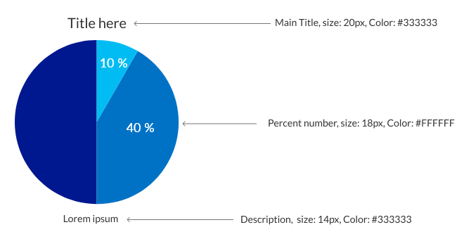
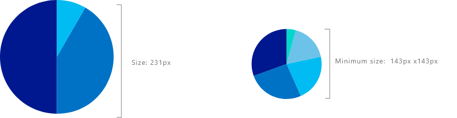
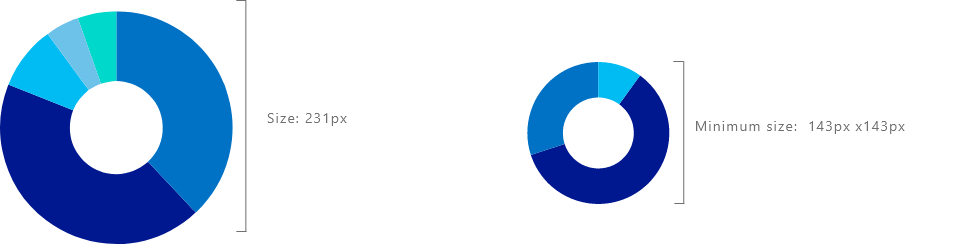
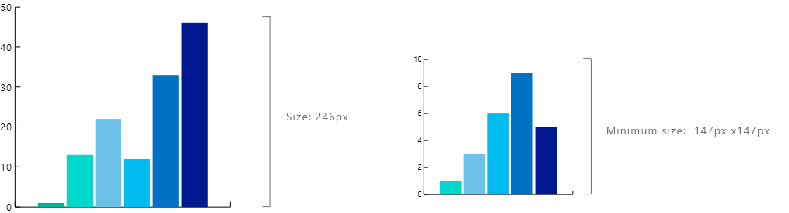
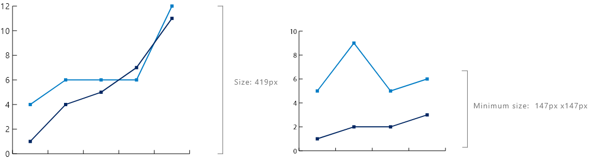
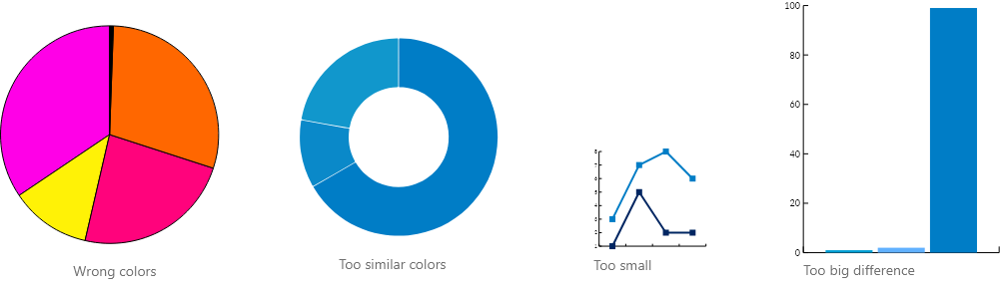

## Colors

Color | Color name | Color code
--- | --- | ---
Primary colors |  | 
 | Primary color #1 | #00188F
 | Primary color #2 | #0072C6s
 | Primary color #3 | #00BCF2
 | Primary color #4 | #6DC2E9
 | Primary color #5 | #00D8CC
 | Primary color #6 | #00B294
 | Primary color #7 | #007233
 | Primary color #8 | #08A14E
Sentiment colors |  | 
 | Negative | #D64554
 | Positive | #1AAB40
 | Neutral | #D9B300
Divergent colors |  | 
 | Max | #262A76
 | Middle | #0072C6
 | Min | #00BCF2
Font colors |  | 
 | General | #707070
 | Title | #585858 

## Typography

Typography used in data visualization is Segoe UI.

## Chart design

### Pie chart

### Donut chart

### Column chart

### Line chart

## Avoid these

