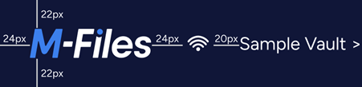

## M-Files desktop Logo

{:.borderless}

Logo settings:

* Width 98 px
* Height 24 px
* Resolution 72 dpi
* Color depth 32 bit
* Use transparent background, alpha channel included
* PNG file format

### Distances

* From top 24px
* From Left 24px

{:.borderless}

### Download

<ul class="quicklinks">
	<li class="api"><a href="{{ site.baseurl }}/User-Experience/Logo/M-Files logo white.png">
	 &nbsp;
	Download M-Files Desktop logo (png) </a></li>
	<li class="api"><a href="{{ site.baseurl }}/User-Experience/Logo/M-Files logo white.svg">
	 &nbsp;
	Download M-Files Desktop logo (svg) </a></li>
</ul>
