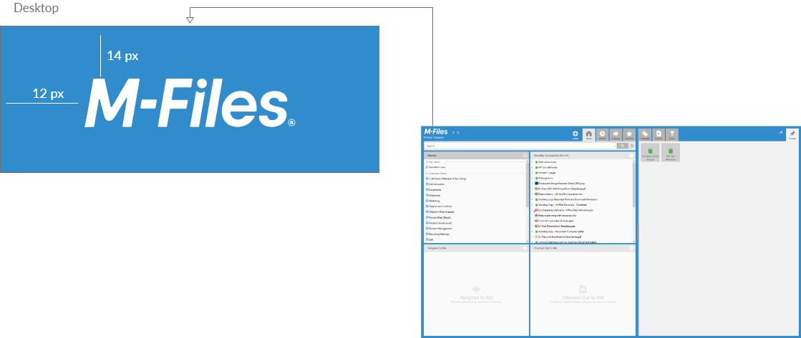

## M-Files desktop Logo

{:.borderless}

Logo settings:
* Width 128 pixels
* Height 32 pixels
* Resolution 72 dpi
* Color depth 32 bit
* Use transparent background, alpha channel included
* PNG file format

### Distances

Distances
* From top 14px
* From Left 12px

{:.borderless}

### Download

Desktop logo (white)
{:.borderless}

<ul class="quicklinks">
	<li class="api"><a href="{{ site.baseurl }}/UX-Design/Logo/desktop-logo-2021.png">
	 &nbsp;
	Download M-Files Desktop logo </a></li>
</ul>