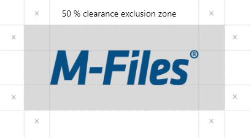
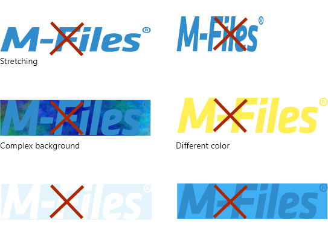

## Different logos

Logo | Name | Color | Where to use
--- | --- | --- | ---
{:.borderless .leftcol} | White logo | #FFFFFF / R = 255, G = 255, B = 255  | Desktop
{:.borderless .leftcol} | Dark logo | #064F85 / R = 6, G = 79, B = 133  | Marketing material, presentations etc.
{:.borderless .leftcol} | Bright logo | #00B1EF / R = 0, G = 177, B = 239 | Marketing material, presentations etc.
{:.borderless .leftcol} | Black logo | #303030 / R = 48, G = 48, B = 48  | Marketing material, presentations etc.

## Protected area

{:.borderless}

## Avoid these

{:.borderless}

## Distances

{:.borderless}

## Download

Desktop logo
{:.borderless}

<ul class="quicklinks">
	<li class="api"><a href="{{ site.baseurl }}/UX-Design/Logo/white-logo.png">
	 &nbsp;
	Download M-Files Desktop logo </a></li>
</ul>