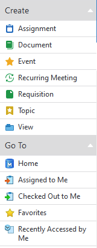

{:.borderless}

M-Files offers various ways of organizing vault contents, and letting the user access them with ease.

## Searching

Search allows users to quickly find objects.

{:.borderless}

{:.borderless}

## Views

Views are shown in the [Listing Area]({{ site.baseurl }}/UX-Design/Page-Layout/#listing-area) and allow users to drill down to locate the content they need. Each view can be used to search (and further refine a search) across the vault contents, displaying objects that match the search criteria. Unlike traditional folders, objects may appear in multiple views, allowing views to provide exactly the information the user requires at the time they need it.

## Breadcrumb 

{:.borderless}

A breadcrumb is displayed above listing area indicates track of current navigation, which can also be used for jumping back to any steps in the navigation hierarchy

## Task pane navigation

{:.borderless}

Through task pane user can navigate to different features through menu items. "Create" and "Go to" can also be expanded or shrink with arrow icons

## Forward and back buttons

With the forward back and arrows, shown above the breadcrumb, user can navigate within their navigation history.

## Relationships

Relationships are automatically created by metadata structure, or can be manually created by dragging and dropping objects onto each other. Related objects can be inspected by clicking the small chevron (triangle) directly to the left of the object in listing or the relationship dialog. This offers an efficient way of navigating related vault content by browsing contextually within specific objects.
