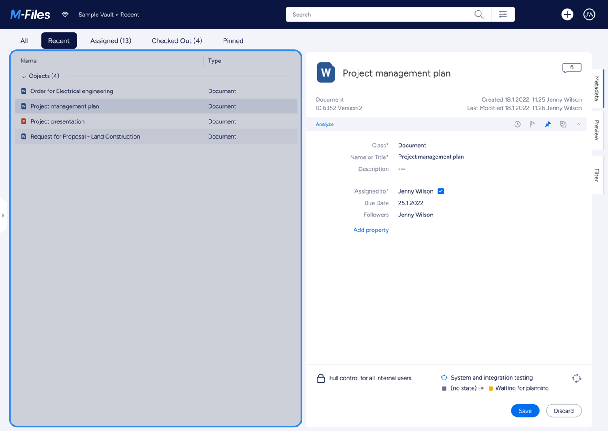
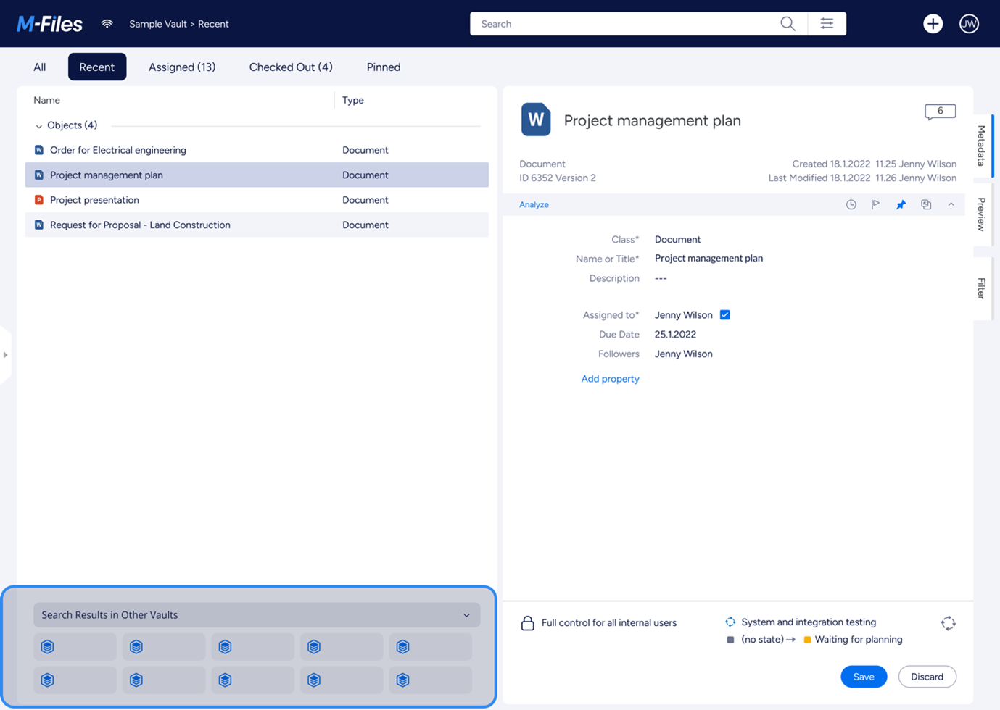
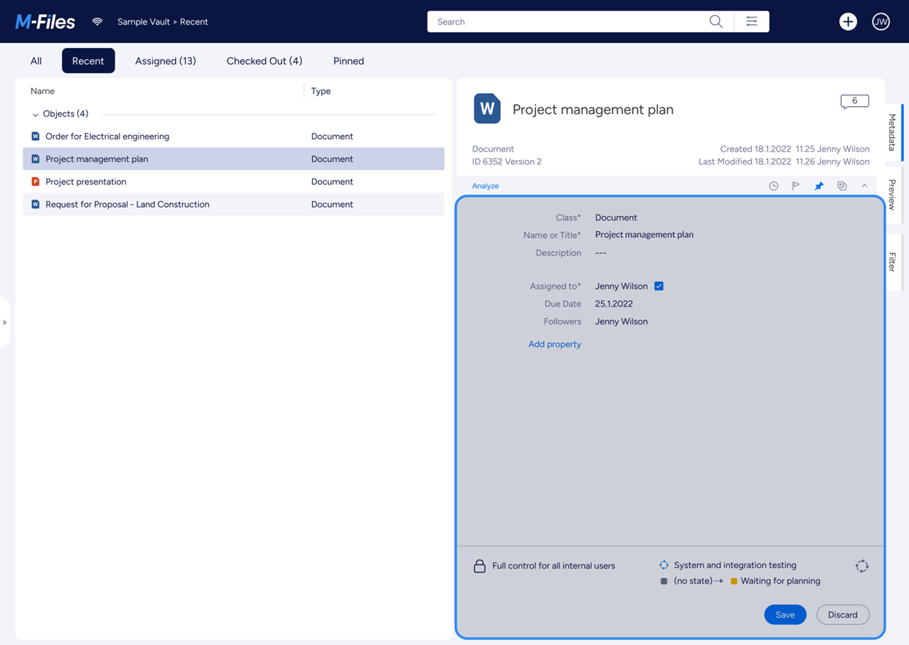

{:.borderless .clear}

## Layout areas

The M-Files Desktop client layout includes three general layout areas:

 * The [Top Pane](#top-pane) holds essential features that are needed all the time, such as structured navigation and vault- and user-operations.
 * The [Listing Area](#listing-area) occupies the left half below the [Top Pane](#top-pane). The listing area shows access to content as the user navigates the vault structure.
 * The  [Right Pane](#right-pane) is at final level of the navigation, it contains the metadata and object-operations for selected object(s) and filter.

There are also sub-areas as the [Bottom Pane](#bottom-pane) and the [Task Pane](#task-pane), which are explained further below.

### Top Pane

The `Top Pane` is a full-width header located above the content areas of the application. It hosts most of the navigation function groups:

*	M-Files logo with link to home
*	A breadcrumb shows current location
*	Create function and vault main navigation
*	Search and advanced filters
*	The account panel (to log out, to alter notification settings, and to log in/out of external repositories)

**Style and layout parameters:**   

*	{: .swatch style="--hex-color: #0A1541" title="#0A1541"}Background-color: #0A1541
*	Margin: 24px
*	Logo-size: 95x24px
*	Font: Segoe UI, size 14, regular, line height 20
*	{: .swatch style="--hex-color: #ffffff" title="#ffffff"}Font-color-breadcrumb: #ffffff
*	{: .swatch style="--hex-color: #6C728D" title="#6C728D"}Font-color-search: #6C728D
*	{: .swatch style="--hex-color: #0A1541" title="#0A1541"}Font-color-search: #0A1541
*	Icon-size: 24x24px, 32x32px
*	Search-size: 434x34px
{:.swatches}

### Listing Area

The Listing Area occupies the left half of the application underneath the [Top Pane](#top-pane). It lists all views, files and other objects when navigating views or searching. It can also show pinned objects.

**Style and layout parameters:**   

*	Padding: 10px 24px 10px 24px
*	Font-size: 14px
*	{: .swatch style="--hex-color: #0A1541" title="#0A1541"}Font-color: #0A1541
*	{: .swatch style="--hex-color: #F2F4F9" title="#F2F4F9"}Background-color: #F2F4F9
*	{: .swatch style="--hex-color: #ffffff" title="#ffffff"}Background-color (listing area): #ffffff
{:.swatches}

### Bottom Pane

The `Bottom Pane` actually is a sub area within the [Listing Area](#listing-area).

**Style and layout parameters:**   

* {: .swatch style="--hex-color: #ffffff" title="#ffffff"}Background-color: #ffffff
* {: .swatch style="--hex-color: #F3F3F6" title="#F3F3F6"}Background-color (content): #F3F3F6
{:.swatches}

### Right Pane

The `Right Pane` plays an important role in offering detailed control options over object properties, previews, search and personalization. Its contents switch contextually according to the selected object or current function. Additionally, the contents of the right pane can be customised using the [User Interface Extensibility Framework]({{ site.baseurl }}/Frameworks/User-Interface-Extensibility-Framework/Dashboards/#within-a-custom-tab) to show additional tabs of content. 

**Style and layout parameters:**   

*	{: .swatch style="--hex-color: #F2F4F9" title="#F2F4F9"}Background-color: #F2F4F9
*	{: .swatch style="--hex-color: #fffff" title="#fffff"}Background-color(content): #fffff
*	Right-margin: 8px
{:.swatches}

### Header

The Right Pane Header is the top most part inside the [Right Pane](#right-pane). Often it is used to show the vital information of the selected item, such as the object ID, version, and checkout information.

**Style and layout parameters:**   

* Background-color: #F2F4F9
* {: .swatch style="--hex-color: #fffff" title="#fffff"}Background-color (header): #ffffff
* Padding: 24px
* Height: 150px
* {: .swatch style="--hex-color: #363A40" title="#363A40"}Font-color: #363A40
* {: .swatch style="--hex-color: #6C728D" title="#6C728D"}Font-color (secondary): #6C728D
* Font-size (heading): 22px
* Font-size (subheading): 14px
{:.swatches}

### Object Tools Ribbon

The `Right Pane Object Tools Ribbon` shows buttons to execute common object-specific functions, such as flag and pin object.

**Style and layout parameters:**

*	{: .swatch style="--hex-color: #F2F4F9" title="#F2F4F9"}Background-color: #F2F4F9
*	Padding: 6px 24px 6px 24px
*	Height: 32px
*	Icons-size: 16 x 16px
*	{: .swatch style="--hex-color: #006EEF" title="#006EEF"}Font-color: #006EEF
{:.swatches}

### Metadata Form

The Metadata Form displays the properties of the selected object. Depending on your access rights, you may also be able to edit some of the properties. The layout is largely driven by the class of the selected object, but can be customised using [Metadata Card Configuration rules]({{ site.baseurl }}/Built-In/Metadata-Card-Configuration/).

**Style and layout parameters:**   

*	{: .swatch style="--hex-color: #F2F4F9" title="#F2F4F9"}Background-color: #F2F4F9
*	{: .swatch style="--hex-color: #ffffff" title="#ffffff"}Background-color (metadata): #ffffff
*	Padding: 16px 24px 0px 24px
*	Font-size: 14px
*	{: .swatch style="--hex-color: #6C728D" title="#6C728D"}Font-color (name): #6C728D
*	{: .swatch style="--hex-color: #0A1541" title="#0A1541"}Font-color (value): #0A1541
*	{: .swatch style="--hex-color: #0069E0" title="#0069E0"}Font-color (link): #0069E0
{:.swatches}

### Task Pane  

The Task Pane is where quick shortcuts are collected. The Task Pane can be collapsed and expanded by clicking of the handle on its right side. The task pane is kept for backwards compatibility.

**Style and layout parameters:**   

*	{: .swatch style="--hex-color: #ffffff" title="#ffffff"}Background-color: #ffffff
*	Width: 200px
*	Font-color: #363A40
*	Font-size: 14px
*	Font-size (Group header): 14px
*	Cell-icon-size: 16px
*	Cell-padding: 10px 16px
*	{: .swatch style="--hex-color: #ffffff" title="#ffffff"}Cell-background-color: #ffffff
*	{: .swatch style="--hex-color: #E5E9F3" title="#E5E9F3"}Cell-background-color (Group header): #E5E9F3
{:.swatches}

## Layout Controls  

### Expanding/collapsing control  

Some panels have more flexibility with their layout. For example: both the [Right  Pane](#right-pane) and [Task Pane](#task-pane) can be collapsed to make additional space on the screen. This can be done by clicking the "handle" in the middle of the layout divider. Clicking the handle again will toggle the panel back to its original size.

#### Collapsing in action for Right pane  

##### Expanding action for Task pane  

**Style and layout parameters:**  

*	{: .swatch style="--hex-color: #F2F4F9" title="#F2F4F9"}Background-color: #F2F4F9
*	Handle-width: 16px
*	{: .swatch style="--hex-color: #ffffff" title="#ffffff"}Handle-color: #fffff
*	Handle-height: 86px
{:.swatches}
