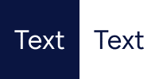
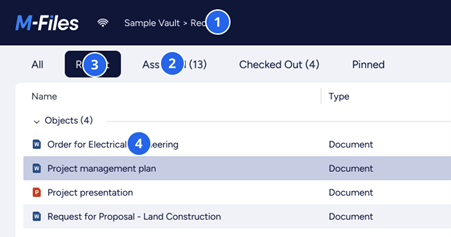

Good typography is invisible, enabling users to have a seamless experience while they’re using M-Files products.

## Typefaces

M-Files Desktop uses Segoe UI typeface.

{:.borderless}

## Scale

Typography has 4 different scales.

{:.borderless}

## Text and background

Text is displayed bit diferently depending on the background color. With blue background white text is used and with gray background darker text is used.

{:.borderless}

## How to use and when

Below is explained how to use different fonts in M-Files Desktop.

### Vault listing typography

{:.borderless}

1.	Lato 14px, White #FFFFFF
2.	Lato 16px, Gray 1 #363A40
3.	Lato 14px, Gray 1 #363A40
4.	Lato 14px, Gray 1 #363A40

### Metadata card and text

{:.borderless}

1.	Lato 20px, Gray 1 #363A40
2.	Lato 14px, Gray 2 #767676
3.	Lato 14px, Gray 2 #767676
4.	Lato 14px, Gray 1 #363A40
5.	Lato 14px, Gray 1 #363A40
6.	Lato 14px, Gray 1 #363A40
