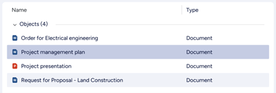
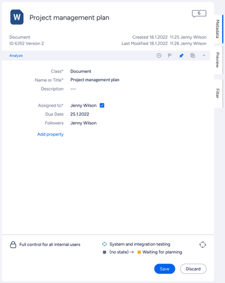

This page describes the various UI components used by M-Files clients, their function, and common styling parameters.

## Menu

Located in the top pane, Menu provides direct access to views and other main functions. From menu you can access All, Recent, Assigned, Checked Out and Pinned.

**Style and layout parameters:**  

*	{: .swatch style="--hex-color: #0A1541" title="#0A1541"}Text-color (inactive): #0A1541
*	{: .swatch style="--hex-color: #ffffff" title="#ffffff"}Text-color (active): #ffffff
*	{: .swatch style="--hex-color: #0A1541" title="#0A1541"}Highlight-color: #0A1541
*	Font-size: 16px
{:.swatches}

## Lists

A List is the typical method for displaying a collection of multiple items such as views or objects. Lists are mostly located within the [Listing Area]({{ site.baseurl }}/UX-Design/Page-Layout/#listing-area).

**Style and layout parameters:**  

*	Row-height: 36px
*	{: .swatch style="--hex-color: #0A1541" title="#0A1541"}Font-color (heading): # 0A1541
*	Font-size (heading): 14px
*	Padding-left (heading): 24px:
*	{: .swatch style="--hex-color: #0A1541" title="#0A1541"}Font-color (listing): # 0A1541
*	Font-size (listing): 14px
*	Padding-left (listing): 24px:
*	Icon-size: 16px
{:.swatches}

### List grouping header

A List Grouping can be used to organize listed objects, grouping them by object type or a specific metadata property. The grouping appears as a header component with textual title and expanding/collapsing control on right side.

**Style and layout parameters:**  

* {: .swatch style="--hex-color: #ffffff" title="#ffffff"}Background-color: #ffffff
* {: .swatch style="--hex-color: #0A1541" title="#0A1541"}Font-color: #0A1541
* Font-size: 14px
{:.swatches}

## Search 

Search function in M-Files is hosted by `Search bar`, and enhanced by `Search filters` and `Advanced search options`.  

### Search bar

In top pane, a Search Bar with search field, search button and access to Advances search options can be found.

#### Search filter

Search Filters tab will be activated when search field is focused. User will find options to enhance the search function before or after search is performed.

#### Advanced search options

Advanced search options will be toggled on or off by clicking on the right most icon of the Search bar.

## Dialogs 

Example of a common Dialog in M-Files that consists a title, an icon, a dialog message and a button group.

## Menus

Here is an example of a context menu activated by right-click on an object which provides corresponding functions.  

Context menu items can be added using the [User Interface Extensibility Framework]({{ site.baseurl }}/Frameworks/User-Interface-Extensibility-Framework/).
 
## Metadata card 

Metadata Card is dedicated for displaying and editing Metadata for object classification and basic properties of selected object(s). User also can access object related functions from Function Ribbon.

### Function Ribbon 

By using function buttons on the ribbon, user are able to Follow and Pin objects. With the M-Files release, we also introduced the Analyze button. Clicking this button will execute any registered [Intelligence Services](https://www.m-files.com/user-guide/latest/eng/intelligence_services.html) for the document, and show any additional metadata suggestions on the metadata card.

### Buttons

Buttons are used to move to the next step, confirm or cancel actions.
