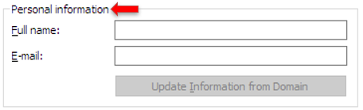
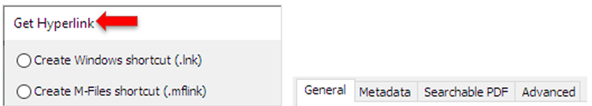

This writing style guide is intended for those who write customer-facing content for M-Files and other related products. It provides stylistic and grammatical guidelines as well as punctuation ground rules for writing clear and consistent user documentation. The style guide also includes specific guidelines for creating user interface texts. These guidelines should be followed by everyone concerned to ensure that all content is written in the same, clear, and concise manner.

## Conciseness and Consistency

* Stay concise. Consider what the user absolutely needs to know and leave out any non-essential details.
    * If the issue or topic is especially complex, instruct the user to see supplemental material.

CORRECT | INCORRECT  
--- | --- |
The configurations editor lets you create metadata card configuration rules and modify settings of external repository connectors, intelligence services, and other applications that have been installed to the vault. | The configurations editor in M-Files Admin allows you to define configurations for the following features of the vault: vault settings, custom vault data, metadata card, federated authentication, intelligence services, external connectors, vault applications The configurations in the editor are hierarchical. You can select subsections of a configuration in the gray navigation area, and the scope of the configuration shown in the Configuration or the Advanced tab changes accordingly.
Electronic signing is not available because the necessary metadata definitions for creating signature objects have not been set. For more information, refer to the M Files user guide. | Electronic signing will not be available because the required metadata definitions for creating signature objects have not been set. In order for automatic signature objects to be created in M-Files, aliases must be created for the new object type as well as for the required property definitions. The aliases are used for creating objects at the time of signing. If you are using M-Files Compliance Kit, these definitions should already be available. Otherwise, you should create the required metadata definitions in M-Files Admin in order to activate the separate signature objects.

* Stay consistent. Always use the same terms for the same elements. This makes it a lot easier for the users to find their way around the user interface.

CORRECT | INCORRECT  
--- | --- |
You can add content to your favorites by right-clicking on an item and selecting **Add to Favorites** in the  context menu, or by clicking the star icon on the option ribbon  of the metadata card. | You can add content to your favorites by right-clicking on an item and selecting **Add to Favorites** in the shortcut menu, or by clicking the star icon on the toolbar of the object properties pane.
This command adds the object to the Pinned tab. | This command adds the object to the Pinboard.

## Tone and Voice of User Interface Texts

This section applies to user interface texts only.
{:.note}

* Keep the texts casual, polite, and friendly.
    * Use _sorry_ and _please_ if it feels natural to do so.
    * Feel free to use contractions like _don't, shouldn't, we're,_ and so on.
    * Do not, however, use abbreviations such as _etc., e.g.,_ and _i.e._

CORRECT | INCORRECT  
--- | --- |
Sorry, but we couldn't get you the most recent version. | The most recent version is unavailable.
Please try again later. | The operation can be attempted again  at a later time.

* If you have to choose, be easily understandable rather than colorful and exciting. In most cases, however, being clear does not automatically mean that you need to also sound flat and uninteresting

## Style Conventions

This section outlines the style conventions used for at M-Files.

### Standard American English

All M-Files content must be written in **Standard American English.** The most significant difference between written Standard American English and, say, written British English is that certain words are spelled differently. Pay special attention to how you spell certain words.

The tables below list spelling differences of words and suffixes (word endings) between Standard American English and British English. Please note that the lists are not by any means exhaustive, but they cover some of the most common differences. Whenever you are unsure of how a word is spelled in Standard American English, consult a dictionary, such as the online dictionaries by [Merriam-Webster]({{ site.baseurl }}/User-Experience/Writing-Style/#reference-documents) or [Macmillan]({{ site.baseurl }}/User-Experience/Writing-Style/#reference-documents).

#### Words with Specific Endings

AMERICAN | BRITISH  
--- | --- |
**-ize** Utilize, Minimize | **-ise** Utilise, Minimise
**-ization** Localization, Utilization | **-isation** Localisation, Utilisation
**-yze** Analyze | **-yse** Analyse
**-or** Color, Behavior | **-our** Colour, Behaviour
**-er** Center, Caliber | **-re** Centre, Calibre
**-se** License | **-ce** Licence
**-og** Catalog | **-ogue** Catalogue

#### Verb Inflection Differences

AMERICAN | BRITISH  
--- | --- |
Canceling | Cancelling
Signaling | Signalling
Dialing | Dialling
Learned | Learnt
Spelled | Spelt

#### Spelling Differences

AMERICAN | BRITISH  
--- | --- |
Check box | Tick box
Counterclockwise | Anticlockwise
Zip code | Postcode
Airplane | Aeroplane
Fiscal year | Financial year
Elevator | Lift

### Readability

Avoid large chunks of text. Too much text in the user interface looks scary and lowers the chance of the user actually reading it.
In documentation, the maximum number of words in a sentence is:
* 20 in procedures

    `In M-Files Admin, go to the "Advanced Vault Settings" section.`

* 25 in descriptive writing

    `You can control the workflow of the object and do a workflow state transition with the workflow-related fields at the bottom of the metadata card.` 

### Capitalization

Capitalization means writing a word with the first letter as an upper-case letter and the rest of the word in lower case. This section sets the ground rules for using capitalization in M-Files content.

#### Headings

Headings should use the so-called _title case_, in which the first letter of each _major_ word in the heading is capitalized, including individual words in hyphenated word combinations (such as _Client-Side Registry Settings_). Articles (_a/an/the_), conjunctions, and prepositions _with fewer than five letters_ are not capitalized unless they start the heading. Examples of conjunctions not to be capitalized are _and, but,_ and _if_. Examples of prepositions not to be capitalized are _at, to, for,_ and _with_.

In contrast to the title case is the sentence case, which is the standard way of capitalizing English sentences. In the sentence case, only the first letter of a sentence is capitalized and subsequent letters are in lowercase, with the exception of proper names and acronyms.

Here are some examples of the title case:

`Using Federated Authentication with M-Files` 

`Comparison Between Esperanto and Ido` 

`A Handy Guide to Cycling Routes in Tampere`

#### Proper Names

Proper names are nouns denoting unique entities. Proper names are always capitalized and are thus orthographically distinguished from other parts of speech in sentence case. Proper names include product names (such as _M-Files_), organization names (such as _Microsoft_), place names (such as _Tampere_), persons (such as _Jacques Anquetil_) or any other names of individual entities.

#### Acronyms

Acronyms are abbreviations formed from the initial letters or parts in a phrase or a word. Examples of acronyms include _URL, laser, HDMI, tRNA,_ and _PnP_. Acronyms are written in all uppercase, mixed case or lowercase, but most commonly follow the all-uppercase capitalization scheme, in which every letter in the acronym is capitalized (such as in _HDMI_ and _URL_).

Some acronyms use mixed-case capitalization, especially the ones that are derived from an existing acronym by affixing. _tRNA_, for instance, uses a mixed-case capitalization scheme, since it is formed by affixing "transfer" to the acronym RNA. PnP similarly uses mixed-case capitalization, since the letter "n" in the acronym stands for "and", which is commonly written in lowercase even in title case.

If the sentence begins with an acronym that starts with a lowercase letter, do not capitalize the first letter.
{:.note}

Some commonly used acronyms have taken on an identity as regular words. Such acronyms are therefore written in all lowercase letter. Examples of such acronyms include _laser_ and _scuba_.

Do not use apostrophes (') when forming plural forms of acronyms. For example, write _URLs_, not _URL's_.

#### M-Files Desktop, Classic M-Files Web, and M-Files Admin

Use **title case** for the following elements:

* Dialog and tab titles

{:.borderless} {:.borderless}

* Menu items

{:.borderless} 

* Button labels

{:.borderless} 

* Node names in navigation hierarchys

{:.borderless}

Use **sentence case** for the following elements:
* Check box and radio button options

{:.borderless} 
{:.borderless}

* Drop-down list options

{:.borderless} 

* Group box labels

{:.borderless} 

* Value and setting labels

{:.borderless} 

* Dialog body text

{:.borderless} 

#### M-Files Mobile for iOS

Use title case for message titles, button names, and menu items. Use sentence case for message content. When in doubt, use title case.

#### M-Files Manage, New M-Files Web, and All Other New User Interfaces (Desktop)

Use sentence case throughout the user interface.

### Punctuation

This section provides ground rules for the proper use of punctuation. These guidelines consist of agreed-upon conventions of specific cases where variation in the use of punctuation may occur.

#### Colons

In addition to using colons (:) normally in any body text content, add a colon after the following elements:
* Labels calling for the user's attention like _Note_ or _Important_
* Value and setting labels in various dialogs like in the example below

{:.borderless}

#### Commas and Semicolons

Rules for using commas (,) and semicolons (;):
* Use a comma to separate three or more words, phrases, or clauses in a series. Comma must also be used before the final conjunction (_and, or, or nor_) in a series of three or more elements:

    `You can find the corresponding M-Files functions can be in PowerPoint versions 2003, 2007, 2010, and 2013.`

* Use a comma to separate an introductory phrase from the rest of the sentence:

    `In M-Files, you can create multi-file or single-file documents.`

* Use a comma before a conjunction that links two independent clauses:

    `The server was specified in the previous field, and in this field, you specify the connection port.`

* Do not use a comma before the word _that_. This is today considered nonstandard in English.
* If the items in a list are long, complex, or contain conjunctions or commas, use a **semicolon** (;) to separate such items if absolutely necessary.

#### Question Marks

Place a question mark (?) at the end of any question. This also applies to the user interface.

#### Quotation Marks

Quotation marks are used for identifying named entities, such as object or command names, in text content. Always use double quotes (") when quoting something. Use single quotes (') only if you need to use quotation marks inside double quotes.

Use double quotes to refer to user interface elements in cases where you are unable to italicize or bold the text referring to the element. Referring to user interface elements in headings, for example, can be one such case.

In the user interface, use both quotation marks and apostrophes sparingly. For example, referring to short command names does not usually require using quotation marks: _Use the Refresh Now command to resynchronize the group members_.

#### Dashes

There are two types of dashes to be used in documentation:
* En dash
* Hyphen

You can create an en dash (–) by typing ALT+0150 on Windows or by typing a single hyphen between two words in Word with AutoFormat enabled. The en dash is commonly used for indicating a closed range of values. Follow these guidelines for using en dashes:

* Use an en dash with no whitespace around the dash to indicate a range. Alternatively, you can use constructions such as _from_ … to for indicating a range:

    `Repeat the steps 1–4 separately for each subtask.`

    `Repeat the steps from 1 to 4 separately for each subtask.`

* Use the en dash to indicate a relationship between two things, for instance:

    `The client–server model`

* Do not use the en dash to indicate a negative or an empty value or as a list bullet.

Use the hyphen (-) character in the following cases:

* To separate a prefix and the word stem when the prefix ends with the same letter as the first letter of the word stem, or when adding a prefix results in an ambiguous word:

    `co-worker, re-elect`

* The prefixes _ex-, all-,_ and _self-_ are special cases. Always use a hyphen with them:

    `Ex-president, all-inclusive, self-explanatory`

* Use a hyphen between attributive words in compound modifiers:

    `Pre-shared key, user-specific settings, high-octane gasoline`

#### Exclamation Points

Avoid exclamation points (!).

#### Periods

Periods (.) are used at the end of complete sentences that are not questions or exclamations. Use a period at the end of a list item only if the item is a complete sentence or if it continues the list-introducing sentence fragment.

**Periods in M-Files Desktop, M-Files Web, and M-Files Admin**

Use periods after complete sentences that are not questions or exclamations and that do not represent any of the elements mentioned in the following list:

* Dialog and tab titles

{:.borderless}

* Group box labelss

{:.borderless}

* Menu items

{:.borderless}
 
* Button labels

{:.borderless}
 
* Node names in a navigation hierarchy

{:.borderless}
 
* Check box and radio button options

{:.borderless}
     
* Drop-down list options

{:.borderless}
 
* Group box labels
 
{:.borderless}

* Value and setting labels

{:.borderless}

**Periods in the M-Files Mobile Apps**

Include a period only after **body text** in message boxes and alerts.

{:.borderless}

#### Ellipses

Do not include ellipsis (…) in user documentation even if the ellipsis is part of the user interface text.

Use ellipses to indicate that something is in progress or requires further user input:

* Menu items and button labels referring to actions that will require user input

    `Add…`

    `Make Copy…`

* Process indicators 

    `Searching…`

    `Downloading the files…`

#### Slashes

Do not use a slash (/) as a substitute for the word _or_, that is, to indicate a choice between two or more alternatives. Use the word _or_ instead.

OK | NOT OK  
--- | --- |
By using the _Change state_ function, you can also add comments to the object while you are changing the workflow, the workflow state, or both. | By using the _Change state_ function, you can also add comments to the object while you are changing the workflow and/or workflow state.

### Terminology

Avoid technical jargon and overly technical and abstract terms.

CORRECT | INCORRECT 
--- | --- |
Sorry, but you can't use this operation for value list based properties. | The operation is not supported for lookups. 
Update object permissions based on the changes to the named access control list  "%s". | Propagate changes to the NACL "%s".

Do not use deictic expressions like _today, here, below, above, or on the left_. Their context can change. However, when you refer to any commands, buttons, or other elements in the user interface, make sure that the user does not have to guess where to find them, either.

The table lists the correct terms to use in documentation. Please use these terms to keep the language in documentation consistent.

USE | DO NOT USE 
--- | --- |
and | &
and so on, and so forth | etc.
before | prior to
compare | c.f.
database | DB
do, complete | perform
for example, for instance, such as | e.g.
if, when | in the event that
Note: | N.B.
that is, meaning, in other words | i.e.
therefore, thus | ergo
to | in order to
select | tick
check box | tick box, option check box
click | click on
context menu | contextual menu, shortcut menu, pop-up menu
deselect | clear
dialog | dialogue, window
field |text box, text entry box
drop-down menu | pull-down list, pull-down list
email | e-mail
enter, write | type, input
use | utilize
select | choose
value list based property | lookup, lookup property
Windows notification area | system tray, status area
The **New User** dialog is opened. | The **New User** dialog appears. The **New User** dialog emerges.

: _A dialog_ is most often defined as a small window prompting for user response, whereas a _window_ is a broader concept, essentially covering the term _dialog_ as well.
{:.note}  

### Referring to User Interface Elements

Use a **bolded font** when referring to any user interface elements, like buttons, links, and titles. If font bolding is not available, use double quotes.

When referring to non-interactable user interface elements, use a definite article followed by the name of the element and then the type of the element:

The **New User** dialog is opened.

When referring to interactable user interface elements, use just the name of the element:

Click **OK** once you are done.

Sometimes, for clarity, it can be necessary to add the user interface element as an icon as well. In these cases, add the icon in parentheses right after the name of the user interface element:

Click the **Create** ({:.borderless}) button and then select **Document**... from the context menu.

If the icon is big, consider making the screenshot smaller.

### Referring to Other Content

When you refer to content that is in the same documentation where you refer from, use the verb "see". When you refer to external documentation, use the verb "refer".

`For more information, see Adding Users.`

`For more information, refer to Editing Content in the M-Files user guide.`

### Abbreviations and Acronyms

Spell out the complete term the first time an abbreviation or acronym appears in the body text of the document and mention the shortened form in parentheses right after the complete term. After you have introduced and spelled out the shortening, use the shortened form throughout the rest of the document.

Here is an example:

Organizations have traditionally relied on **Virtual Private Network (VPN)** technology to secure access to corporate resources (such as M-Files vaults) from outside the private network of the organization.

...

Together, the HTTPS encryption and the use of a pre-shared key as a second factor in authentication provide similar security as **VPN** but without the complexity and compatibility challenges of **VPN.**

Remember to include all acronyms in the glossary of the document.

### Headings

This section provides guidelines for the form and structure of headings. The following rules apply to all types and levels of headings:

* Keep headings brief and to the point, and make sure that they describe the content accurately and properly.
* Each heading must be unique. Make sure that there are no synonymous headings in a document.
* Use the [title case]({{ site.baseurl }}/User-Experience/Writing-Style/#headings) for first, second, and third level headings.
* Use the sentence case for fourth level headings.
* Avoid using excessive or unnecessary punctuation in headings (such as parentheses, semicolons, or exclamation marks).
* Never add a period at the end of a heading.

#### Heading Levels

Use first, second, and third level headings for structuring your document. Use a fourth level heading only if absolutely necessary. Do not use more than four heading levels.

#### Heading Structure for Task Procedures

Use the gerund (the _–ing_ form that is used for forming verbal nouns from verbs) form of a verb as the subject in task headings, instead of the sentence-initial _to_-infinitive phrase or a bare infinitive. Below are examples of the correct and incorrect heading structure for task procedures. Instead of using the _how_ to structure, use the –_ing_ form in headings as well as in the document title.

CORRECT | INCORRECT 
--- | --- |
Creating a Login Account | To Create a Login Account
Importing Login Accounts | How to Import Login Accounts
Deleting Objects | Delete Objects

### Lists

Lists are used in documentation to lay out sequential steps for a procedure or to group related pieces of information together.

The rules for lists are:

* Use lists generously, if space permits, to present information in a more digestible format than regular body text.
* Use ordered lists only when the sequence of the items is of special importance.
* Use parallel structures for the items in a list to make the list easier to read. You can use, for instance, a sentence-initial gerund form in all the list items or you can comprise a list of simple noun phrases. The table gives some examples of list items with a parallel structure.

![Noun phrases: M-Files Setup, M-Files Desktop, M-Files Desktop Settings, M-Files Server, M-Files Admin. Imperative form: 1. Open M-Files Admin. 2. Highlight Login Accounts in the tree view. 3. Click New Login Account… on the task pane. Gerundial phrases: Adding new licenses and removing existing licenses, Adding new user accounts and removing existing ones, Changing user details and license types, Downloading M-Files installers. Sentence fragment that begins with a verb: Multi-level interaction between several document vaults enables you to: Replicate data across several locations, Archive data from an actively used vault to an archive vault, Centralize data from several M-Files vaults to a single vault](parrel-structures.png){:.borderless}

* Add a period at the end of a list item only if the list item is a full sentence, or if it continues the list-introducing sentence fragment.
* Begin a list item with a capital letter.
* Add a colon after the introductory phrase.

### Procedures (Step Lists)

Use numbered lists for sequential procedure steps to indicate the order in which a task must be carried out. When writing step lists, follow these guidelines:
* Introduce the procedure with an introductory sentence in the format `To <objective>:`. In Finnish, use the format `<Objective>:`.

    English: `To add a remark:`

    Finnish: `Lisätäksesi huomion:`

* If a step has sub-steps, add a nested list below the step, ordered using lowercase letters as labels, followed by a period:

**EXAMPLE**
1. Open M-Files Admin and go to a vault.

    a) Open M-Files Admin. 

    b) In the left-side tree view, expand a connection to M-Files Server. 

    c) In the left-side tree view, expand Document Vaults, and then expand a vault.

* If a task has more than ten steps, try to split the task into separate, smaller tasks to make the instructions easier to follow.
* If there are multiple ways to complete a task step, use this structure:

**EXAMPLE**
1.	Complete one of these steps:
    * Click **New Login Account** on the task pane
    
    or
    
    * Select **Action > New Login Account**

* If necessary, add a _Result_ section after the step list to give a description of what to expect after they have completed the task successfully.
* You can also add the _Result_ section after an individual step if you consider that the results are not self-evident.

1.	Click **OK.**
    
    **Result:** A warning dialog is opened to tell you that the operation cannot be undone.
    
2.	Click **Yes** to close the warning dialog and start the migration.

### Localizability

* The source string should always enable the translator to create as natural a translation as possible. On the other hand, this should never compromise the quality of the source string.
* Make sure that there is enough space in the user interface for the localizations:
    * If the user interface text length is 10 characters or less, increase the space by 1.5. 
    * If the user interface text length is more than 10 characters, increase the space by 1.3.

## Grammar Rules

This section provides rules for the following linguistic elements:
* Phrases (a word or a group of words that functions as a single unit in the syntax of a sentence)
* Sentences (a grammatically complete series of words that consists of a subject and a predicate, typically beginning with a capital letter and ending with a period)

### Proper Names

Proper names are nouns denoting product names, organization names, place names, persons, and any other names of individual entities. They are written using the initial capital letter.

Even though proper names refer to unique entities, in some cases, it can be necessary to be more specific to make the reference to the name clearer. In these situations, pair the proper name with a superordinate grouping word, such as _window_ or _button_, and with a definite article preceding the name:

* The `<proper name>` `<grouping word>`

    `The New User dialog`

Note that an entity denoted by a proper name may belong to more than one group. In such a case, just use the grouping word you need to refer to.

`The HTTPS protocol`

`The HTTPS encryption`

Write the proper name with initial capital and the grouping word with lowercase letters.

If the proper name is not followed by a grouping word (like in the _M-Files software_), do not use an article.

Correct: `Everything in M-Files is organized by what it is instead of where it is stored.`

Correct: `Everything in the M-Files vaults is organized by what it is instead of where it is stored.`

Incorrect: `Everything in the M-Files is organized by what it is instead of where it is stored.`

Do not use any special formatting for proper names, such as italics or bolding.

### Genitive Case

Use an apostrophe with the letter "s" at the end of a singular noun or just an apostrophe at the end of a plural noun to denote possession for animate entities. For nouns representing inanimate entities, use the _of_ genitive instead to denote possession. If the readability suffers, you can also denote possession with "s" for nouns representing inanimate entities. With singular animate nouns ending with "s", also use the 's to denote possession.

CORRECT | INCORRECT
--- | --- |
Charles's car | Charles' car
Previous versions of M-Files | M-Files's previous versions
Developers' conference | Developers's conference

### Active Voice vs. Passive Voice

Active voice is the basic sentence structure of the English language. It is used in a clause whose subject expresses the agent (the "doer") of the main verb. In contrast to active voice is the passive voice, which is used in a clause whose subject is the recipient of the action that the clause expresses. Below is an example of both voices.

ACTIVE VOICE | PASSIVE VOICE
--- | --- |
M-Files can also store customer and project data. | M-Files can be deployed on-premises, in the cloud, or as a hybrid of both.

Use active voice whenever possible.

Switch to the passive voice only when the primary focus of the clause is not on the subject. In written English, focus is primarily expressed by placing the new, non-derivable, or contrastive information at the beginning of a sentence. By switching to the passive voice, you can start the sentence with the element that would be the object of the sentence in the active voice. You can also use the passive voice when the subject of the clause need not be expressed or it is not known.

### Tense

Documentation is for the most part written in the present tense, or more precisely, the **simple present**. Note that while the present tense generally refers to actions taking place at the present time, it can also have a reference to the future, especially to an arranged future event. Indeed, the simple present tense can be used to refer to future events that are certain to happen. This is why it is a suitable tense to use in contexts such as expected results because it is seen as more assertive than the future tense.

Here is an example:

`Click New Login Account on the task pane.`

Correct: `The New Login Account dialog is opened.`

Incorrect: `The New Login Account dialog will be opened.`

In the example, the present tense form can be regarded as an assertion, while the future tense form is more like a prediction.

Use future or past tenses only if it is required by the context, and if so, use only the simple forms of the past and the present tense. Note, however, that the past and the future tense are more acceptable in relative clauses than in main clauses. 

Here are some examples of acceptable uses of the past and the future tense:

`By enabling this setting, any of the objects that were included in an earlier export set, but are not in the current one, will be deleted in the target vault upon import.`

`Thanks to Automatic Updates, your M-Files installation will always be up to date.`

### Modal Verbs

Modals are used to express for example ability, possibility, permission, or obligation. Modal verbs include _can, could, may, might, should, and must._ In technical documentation and user interface texts, use _should_ only if something is optional. If something must be done, always use _must_.

Use can to tell what the user or the system is able to do. Avoid using _may_. You can use it to describe possibility, but do not use it to tell that the user has permission to do something. As a rule of thumb, do not use _might_.

### Compound Modifiers

Modifiers are words that describe nouns. Modifiers in general can be used in two different syntactic positions:
* Premodifying position, in which the modifier is placed _before_ the word that it modifies
* Postmodifying position, in which the modifier is placed _after_ the word that it modifies

Compound modifiers are adjectives that are made up of two or more attributive words. When a compound modifier is used as a premodifier, the individual words in the compound must be joined with a hyphen. When a compound modifier is used as a postmodifier, the hyphen is not necessary, unless the word is a _permanent_ compound and listed in the dictionary with a hyphen.

COMPOUND MODIFIER AS A PREMODIFIER | COMPOUND MODIFIER AS A POSTMODIFIER
--- | --- |
Vault-specific applications | The applications are vault specific.
A well-known process | The process is well known.

### Gender-Neutral Language

Avoid gender-specific pronouns when writing documentation. There are a number of techniques for using gender-neutral language. The list below provides alternative ways of writing in a gender-neutral manner the sentence _"The user can enter his e-mail address and his full name in the personal information fields"_:

* Use the imperative mood:

    `Enter your email address and your full name in the personal information fields.`

* Use the second person:

    `You can enter your email address and your full name in the personal information fields.`

* Use the third-person plural forms their, them and they in place of the gender-specific her/his, her/him and she/he:

    `The user can enter their email address and their full name in the personal information fields.`

### First Versus Second Person

Avoid mixing the first person (I/me/my) with the second person (you/your). For users, it can be confusing to see both person formats in the same context. Generally, use the second person when asking questions, giving instructions, or describing things to the user.

Examples:

`Do you want to check it out so that you can edit it?`

`You can't use the same path multiple times.`

In some cases, it can be necessary to use the first person to indicate the user's ownership of content or actions:

`Assigned to Me`

`Checked Out to Me`

### Contractions

A contraction is a shortening of a word, word group, or syllable, created by omitting internal letters. _Can't_, for example, is a contraction of _cannot_.

_Do not_ use contractions in documentation. Always write the full form of the word or word group instead. One exception is _of_ in the phrase _o'clock_, in which the contraction is mandatory in contemporary use.

### Numbers

_Cardinal numbers (one, 2, III)_ are used for counting things, while _ordinal numbers (first, 2nd, 3rd, IV)_ are used for putting things in a sequential order. The following sub-sections tells you how to use numbers in documentation.

#### Numerals

The symbols used for numbers (such as _1, 2,_ and _3_) are called numerals. 
The rules for using numerals are:

* Never start a sentence with a numeral. Spell out the number instead.
* Spell out the numbers from zero to nine. Express numbers greater than nine in numerals.

#### Ordinals

* Spell out ordinal numbers from one to nine:

    `First, second, third, fourth, fifth, sixth, seventh, eighth, ninth`

* From the number 10 onwards, use a numeral and a suffix written in superscript above the numeral itself:

    `10th, 11th, 12th, 13th, and so forth`

#### Numbers and Units of Measurement

* Add a space, or ideally a non-breaking space, between a number and an abbreviation of a unit of measurement:

    `50 GB, 120 mm`

* Do not, however, use a space between a number and a symbol representing a unit of measurement:

    `4.7", 60%`

#### Negative Numbers

Negative numbers are written with a minus sign (-) immediately before the first digit of the number:

`-6`

`-100,000`

`-60%`

#### Decimal Numbers and Digit Grouping
Use the period character (.) as a decimal separator. If a number has more than three digits, separate sequences of three digits with a comma, starting from the first digit preceding the decimal point or the last digit if the number does not have a decimal point. Do not sequence the fractional part to the right of the decimal point.

Here are some examples:

`122,072`

`7,430.25`

`3.14159`

#### Currencies

When referring to monetary amounts, use one of these formats:

* Currency symbol followed by the amount with two decimal places:

    `€600,000.00`

* Currency code followed by a space and the amount with two decimal places:

    `EUR 600,000.00`

Negative amounts can be generally indicated with the words _losses_ and _deficit_ in descriptive texts to avoid using the minus sign (-):

`A deficit of €600,000.00`

`Losses of EUR 600,000.00`

In other text types, for instance in tabular data, negative amounts are denoted by a leading minus sign (-). Prefer using the currency symbol in conjunction with the leading minus sign, and use the currency code with a negative amount only if it is absolutely necessary:

`Preferred: -€600,000.00`

`Non-preferred: -EUR 600,000.00`

#### Dates

When referring to dates, use these formats:

* When there is enough space:
    * dd month yyyy
    * Do not include "0" in the one-digit day notation. That is, do not write "02 September 2020".

    `2 September 2020`

* In the user interface, where the space might be limited, and in the change history table of Knowledge Base documents:
    * mm/dd
    * yyyy/mm/dd
    * In these shorter formats, include "0".
    
    `2020/09/02`

## Reference Documents

You may want to see these sources for additional information.
* [Merriam-Webster Online Dictionary](https://www.merriam-webster.com/)
* [Macmillan Dictionary – American English edition](https://www.macmillandictionary.com/dictionary/american/) 
* [Microsoft: User Interface Text](https://docs.microsoft.com/en-us/windows/win32/uxguide/text-ui) 
* [Human Interface Guidelines by Apple](https://developer.apple.com/design/human-interface-guidelines/ios/overview/themes/) 
* [Material Design: Dialogs (Android)](https://material.io/components/dialogs) 
